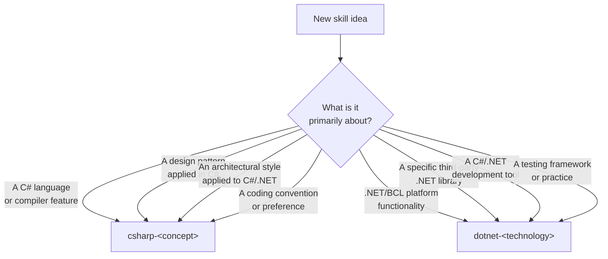

# Skills Catalog

Agentic AI skills for C# / .NET development, designed for use with [Claude Code](https://docs.anthropic.com/en/docs/claude-code/overview) and [OpenCode](https://opencode.ai/).

---

## Installation

Install every skill in the repository:

```bash
npx skills add rheone/Booststraping-LLM-DEV-Container
```

Install specific skills with the `--skill` flag:

```bash
# Install a design pattern skill and a data-access skill
npx skills add rheone/Booststraping-LLM-DEV-Container --skill csharp-strategy-pattern --skill dotnet-ef-core

# Install the test sweep orchestrator and its xUnit companion
npx skills add rheone/Booststraping-LLM-DEV-Container --skill csharp-test-sweep --skill xunit-csharp
```

Install from a local path:

```bash
npx skills add /path/to/llm-dev-container
```

### Manage installed skills

```bash
# See what's installed and active
npx skills list

# Enable / disable selectively
npx skills enable csharp-test-sweep reverse-engineered-docs
npx skills disable audit-remediation-pipeline
```

---

## How skills in this catalog are named

Every C#/.NET skill in this repository carries a prefix that identifies what it's primarily
about: a `csharp-<concept>` skill describes a programming concept or technique as applied in
C#/.NET (a language feature, a design pattern, an architectural style, a convention); a
`dotnet-<technology>` skill describes a specific .NET/BCL API, third-party library, dev tool, or
testing framework. [`csharp-skill-authoring`](skills/csharp-skill-authoring) is the meta-skill that
builds every other skill in this catalog to this same convention.



---

## Skill Catalog

### Meta

| Skill | Summary |
| --- | --- |
| [`csharp-skill-authoring`](skills/csharp-skill-authoring) — [readme](skills/csharp-skill-authoring/README.md) | Scaffolds every other skill in this catalog to a consistent naming, structure, and testing standard. |

### C# Language Features

| Skill | Summary |
| --- | --- |
| [`csharp-async`](skills/csharp-async) — [readme](skills/csharp-async/README.md) | Async/await from its pre-language APM/EAP roots through the current C# version's async syntax. |
| [`csharp-delegates-and-lambdas`](skills/csharp-delegates-and-lambdas) — [readme](skills/csharp-delegates-and-lambdas/README.md) | Delegates, multicast invocation, anonymous methods, and lambda expressions. |
| [`csharp-exception-handling`](skills/csharp-exception-handling) — [readme](skills/csharp-exception-handling/README.md) | Try/catch/finally, exception filters, and structured error handling in C#. |
| [`csharp-expression-trees`](skills/csharp-expression-trees) — [readme](skills/csharp-expression-trees/README.md) | Building, inspecting, and rewriting `Expression<TDelegate>` trees. |
| [`csharp-extension-members`](skills/csharp-extension-members) — [readme](skills/csharp-extension-members/README.md) | Extension methods through the newest extension-member syntax additions. |
| [`csharp-generic-math`](skills/csharp-generic-math) — [readme](skills/csharp-generic-math/README.md) | Writing numeric algorithms generic over type via static abstract interface members. |
| [`csharp-generics`](skills/csharp-generics) — [readme](skills/csharp-generics/README.md) | Generic types, methods, and constraints, including `ref struct` generics. |
| [`csharp-nullable-reference-types`](skills/csharp-nullable-reference-types) — [readme](skills/csharp-nullable-reference-types/README.md) | Nullable annotation context, flow analysis, and migrating an existing codebase. |
| [`csharp-pattern-matching`](skills/csharp-pattern-matching) — [readme](skills/csharp-pattern-matching/README.md) | Type patterns, property patterns, switch expressions, and exhaustiveness. |
| [`csharp-records`](skills/csharp-records) — [readme](skills/csharp-records/README.md) | Record classes and record structs — value equality, `with`-expressions, hierarchies. |
| [`csharp-source-generators`](skills/csharp-source-generators) — [readme](skills/csharp-source-generators/README.md) | Authoring Roslyn incremental and legacy source generators. |
| [`csharp-span-and-memory`](skills/csharp-span-and-memory) — [readme](skills/csharp-span-and-memory/README.md) | `Span<T>`/`Memory<T>` as an allocation-avoiding, slice-based programming technique. |
| [`csharp-system-attributes`](skills/csharp-system-attributes) — [readme](skills/csharp-system-attributes/README.md) | Proactive guidance on which BCL attribute to reach for and why, including `StringSyntax` and trimming/Native AOT annotations. |

### Design Patterns

| Skill | Summary |
| --- | --- |
| [`csharp-adapter-pattern`](skills/csharp-adapter-pattern) — [readme](skills/csharp-adapter-pattern/README.md) | Wrapping an incompatible interface behind the one a consumer expects. |
| [`csharp-builder-pattern`](skills/csharp-builder-pattern) — [readme](skills/csharp-builder-pattern/README.md) | Step-by-step object construction, including the generic self-typed builder form. |
| [`csharp-chain-of-responsibility-pattern`](skills/csharp-chain-of-responsibility-pattern) — [readme](skills/csharp-chain-of-responsibility-pattern/README.md) | A linked chain of handlers, each deciding whether to process or forward a request. |
| [`csharp-command-pattern`](skills/csharp-command-pattern) — [readme](skills/csharp-command-pattern/README.md) | Encapsulating a request as an object, including undo/redo history. |
| [`csharp-decorator-pattern`](skills/csharp-decorator-pattern) — [readme](skills/csharp-decorator-pattern/README.md) | Wrapping behavior around an interface implementation without modifying it. |
| [`csharp-factory-pattern`](skills/csharp-factory-pattern) — [readme](skills/csharp-factory-pattern/README.md) | Factory Method and Abstract Factory for centralizing object creation. |
| [`csharp-fluent-interface`](skills/csharp-fluent-interface) — [readme](skills/csharp-fluent-interface/README.md) | Method-chaining API design: mutable, immutable, and staged (order-enforcing) chain shapes. |
| [`csharp-mediator-pattern`](skills/csharp-mediator-pattern) — [readme](skills/csharp-mediator-pattern/README.md) | A hand-rolled in-process mediator that decouples senders from handlers. |
| [`csharp-null-object-pattern`](skills/csharp-null-object-pattern) — [readme](skills/csharp-null-object-pattern/README.md) | A do-nothing implementation that eliminates null checks at call sites. |
| [`csharp-observer-pattern`](skills/csharp-observer-pattern) — [readme](skills/csharp-observer-pattern/README.md) | Subject/observer notification, C# events, and `IObservable<T>`/`IObserver<T>`. |
| [`csharp-repository-pattern`](skills/csharp-repository-pattern) — [readme](skills/csharp-repository-pattern/README.md) | Abstracting data access behind a generic or per-aggregate repository interface. |
| [`csharp-specification-pattern`](skills/csharp-specification-pattern) — [readme](skills/csharp-specification-pattern/README.md) | Composable, reusable query and business-rule predicates. |
| [`csharp-strategy-pattern`](skills/csharp-strategy-pattern) — [readme](skills/csharp-strategy-pattern/README.md) | Swapping an algorithm's implementation at runtime, interface- or delegate-based. |
| [`csharp-unit-of-work-pattern`](skills/csharp-unit-of-work-pattern) — [readme](skills/csharp-unit-of-work-pattern/README.md) | Coordinating multiple repository operations into one atomic commit. |
| [`csharp-visitor-pattern`](skills/csharp-visitor-pattern) — [readme](skills/csharp-visitor-pattern/README.md) | Double-dispatch operations over a type hierarchy without modifying it per operation. |

### Architecture

| Skill | Summary |
| --- | --- |
| [`csharp-cqrs`](skills/csharp-cqrs) — [readme](skills/csharp-cqrs/README.md) | Separating command (write) and query (read) models, at whatever level of segregation a feature needs. |
| [`csharp-vertical-slice-architecture`](skills/csharp-vertical-slice-architecture) — [readme](skills/csharp-vertical-slice-architecture/README.md) | Organizing a codebase by feature slice instead of by technical layer. |

### ASP.NET Core & Web

| Skill | Summary |
| --- | --- |
| [`dotnet-aspnetcore-authentication`](skills/dotnet-aspnetcore-authentication) — [readme](skills/dotnet-aspnetcore-authentication/README.md) | ASP.NET Core's authentication scheme model, cookies, JWT bearer, and policy-based authorization. |
| [`dotnet-aspnetcore-authorization`](skills/dotnet-aspnetcore-authorization) — [readme](skills/dotnet-aspnetcore-authorization/README.md) | Every ASP.NET Core authorization form: simple, role, claims, policy/requirement, resource-based, custom policy providers. |
| [`dotnet-aspnetcore-controllers`](skills/dotnet-aspnetcore-controllers) — [readme](skills/dotnet-aspnetcore-controllers/README.md) | Controller-based Web APIs — attribute routing, model binding, action filters. |
| [`dotnet-aspnetcore-openapi`](skills/dotnet-aspnetcore-openapi) — [readme](skills/dotnet-aspnetcore-openapi/README.md) | Generating OpenAPI 3.1 documents from minimal APIs and controllers. |
| [`dotnet-dependency-injection`](skills/dotnet-dependency-injection) — [readme](skills/dotnet-dependency-injection/README.md) | The built-in `Microsoft.Extensions.DependencyInjection` container. |
| [`dotnet-health-checks`](skills/dotnet-health-checks) — [readme](skills/dotnet-health-checks/README.md) | Liveness/readiness health check endpoints and orchestrator integration. |
| [`dotnet-minimal-apis`](skills/dotnet-minimal-apis) — [readme](skills/dotnet-minimal-apis/README.md) | Route registration, parameter binding, and endpoint filters for minimal APIs. |
| [`dotnet-openiddict`](skills/dotnet-openiddict) — [readme](skills/dotnet-openiddict/README.md) | An OAuth 2.0 / OpenID Connect server built on OpenIddict. |
| [`dotnet-options-pattern`](skills/dotnet-options-pattern) — [readme](skills/dotnet-options-pattern/README.md) | `IOptions<T>`/`IOptionsSnapshot<T>`/`IOptionsMonitor<T>` and options validation. |

### Data Access

| Skill | Summary |
| --- | --- |
| [`dotnet-automapper`](skills/dotnet-automapper) — [readme](skills/dotnet-automapper/README.md) | Convention-based object-to-object mapping with AutoMapper. |
| [`dotnet-csvhelper`](skills/dotnet-csvhelper) — [readme](skills/dotnet-csvhelper/README.md) | Reading and writing CSV with CsvHelper. |
| [`dotnet-dapper`](skills/dotnet-dapper) — [readme](skills/dotnet-dapper/README.md) | Dapper's micro-ORM extension methods over `IDbConnection`. |
| [`dotnet-ef-core`](skills/dotnet-ef-core) — [readme](skills/dotnet-ef-core/README.md) | Entity Framework Core — `DbContext`, migrations, change tracking, querying. |

### Testing Tools

| Skill | Summary |
| --- | --- |
| [`dotnet-autofixture`](skills/dotnet-autofixture) — [readme](skills/dotnet-autofixture/README.md) | Generating test data automatically with AutoFixture. |
| [`dotnet-bogus`](skills/dotnet-bogus) — [readme](skills/dotnet-bogus/README.md) | Realistic fake test data with Bogus's `Faker<T>`. |
| [`dotnet-justmock`](skills/dotnet-justmock) — [readme](skills/dotnet-justmock/README.md) | Telerik JustMock, including profiler-based Elevated Mocking. |
| [`dotnet-nsubstitute`](skills/dotnet-nsubstitute) — [readme](skills/dotnet-nsubstitute/README.md) | Creating and verifying test doubles with NSubstitute. |
| [`dotnet-respawn`](skills/dotnet-respawn) — [readme](skills/dotnet-respawn/README.md) | Resetting a real test database to a clean state between integration tests. |
| [`dotnet-testcontainers`](skills/dotnet-testcontainers) — [readme](skills/dotnet-testcontainers/README.md) | Disposable, real containers (databases, brokers) for integration tests. |
| [`dotnet-xunit`](skills/dotnet-xunit) — [readme](skills/dotnet-xunit/README.md) | xUnit.net — facts, theories, fixtures, and test collections. |

### Messaging, Background Work & Resilience

| Skill | Summary |
| --- | --- |
| [`dotnet-grpc`](skills/dotnet-grpc) — [readme](skills/dotnet-grpc/README.md) | gRPC services and clients, including streaming RPC patterns. |
| [`dotnet-hangfire`](skills/dotnet-hangfire) — [readme](skills/dotnet-hangfire/README.md) | Fire-and-forget, delayed, and recurring background jobs with Hangfire. |
| [`dotnet-masstransit`](skills/dotnet-masstransit) — [readme](skills/dotnet-masstransit/README.md) | Publishing, consuming, and coordinating distributed messages with MassTransit. |
| [`dotnet-mediatr`](skills/dotnet-mediatr) — [readme](skills/dotnet-mediatr/README.md) | In-process mediator/CQRS-style request and notification dispatch with MediatR. |
| [`dotnet-polly`](skills/dotnet-polly) — [readme](skills/dotnet-polly/README.md) | Retry, circuit breaker, timeout, and other resilience strategies with Polly. |
| [`dotnet-quartz`](skills/dotnet-quartz) — [readme](skills/dotnet-quartz/README.md) | Cron and interval-based job scheduling with Quartz.NET. |
| [`dotnet-rabbitmq`](skills/dotnet-rabbitmq) — [readme](skills/dotnet-rabbitmq/README.md) | Publishing and consuming messages directly against RabbitMQ.Client. |
| [`dotnet-signalr`](skills/dotnet-signalr) — [readme](skills/dotnet-signalr/README.md) | Real-time hub messaging with ASP.NET Core SignalR. |

### Observability & Logging

| Skill | Summary |
| --- | --- |
| [`dotnet-elk-integration`](skills/dotnet-elk-integration) — [readme](skills/dotnet-elk-integration/README.md) | Shipping structured .NET logs into the Elastic Stack. |
| [`dotnet-opentelemetry`](skills/dotnet-opentelemetry) — [readme](skills/dotnet-opentelemetry/README.md) | Traces, metrics, and logs instrumentation with the OpenTelemetry .NET SDK. |
| [`dotnet-serilog`](skills/dotnet-serilog) — [readme](skills/dotnet-serilog/README.md) | Structured logging configuration and sinks with Serilog. |

### .NET/BCL Platform

| Skill | Summary |
| --- | --- |
| [`dotnet-channels`](skills/dotnet-channels) — [readme](skills/dotnet-channels/README.md) | Producer-consumer messaging in-process with `System.Threading.Channels`. |
| [`dotnet-immutable-collections`](skills/dotnet-immutable-collections) — [readme](skills/dotnet-immutable-collections/README.md) | `System.Collections.Immutable` types and their builders. |
| [`dotnet-linq`](skills/dotnet-linq) — [readme](skills/dotnet-linq/README.md) | LINQ query and method syntax across the standard query operators. |
| [`dotnet-reflection`](skills/dotnet-reflection) — [readme](skills/dotnet-reflection/README.md) | Runtime type inspection, dynamic invocation, and attribute reading. |
| [`dotnet-string-handling`](skills/dotnet-string-handling) — [readme](skills/dotnet-string-handling/README.md) | `StringBuilder`, interpolation, raw strings, and allocation-free string parsing. |
| [`dotnet-system-text-json`](skills/dotnet-system-text-json) — [readme](skills/dotnet-system-text-json/README.md) | Serializing and deserializing JSON with `System.Text.Json`. |

### Other Libraries & Tooling

| Skill | Summary |
| --- | --- |
| [`dotnet-autofac`](skills/dotnet-autofac) — [readme](skills/dotnet-autofac/README.md) | The Autofac IoC container — registration, lifetime scopes, modules. |
| [`dotnet-fluentvalidation`](skills/dotnet-fluentvalidation) — [readme](skills/dotnet-fluentvalidation/README.md) | Declarative validation rules for C# objects with FluentValidation. |
| [`dotnet-humanizer`](skills/dotnet-humanizer) — [readme](skills/dotnet-humanizer/README.md) | Turning raw values into human-readable text with Humanizer. |
| [`dotnet-markdig`](skills/dotnet-markdig) — [readme](skills/dotnet-markdig/README.md) | Parsing and rendering Markdown with Markdig's extensible pipeline. |
| [`dotnet-nhibernate`](skills/dotnet-nhibernate) | NHibernate mapping, session lifecycle, and query conventions. |
| [`dotnet-nodatime`](skills/dotnet-nodatime) — [readme](skills/dotnet-nodatime/README.md) | Unambiguous date, time, and time zone handling with NodaTime. |
| [`dotnet-refit`](skills/dotnet-refit) — [readme](skills/dotnet-refit/README.md) | Declarative REST API clients with Refit. |
| [`dotnet-roslyn-analyzers`](skills/dotnet-roslyn-analyzers) — [readme](skills/dotnet-roslyn-analyzers/README.md) | Authoring Roslyn diagnostic analyzers and paired code fixes. |
| [`dotnet-roslyn-syntax-trees`](skills/dotnet-roslyn-syntax-trees) — [readme](skills/dotnet-roslyn-syntax-trees/README.md) | Parsing, querying, and rewriting C# syntax trees with the Roslyn Syntax API. |
| [`dotnet-yamldotnet`](skills/dotnet-yamldotnet) — [readme](skills/dotnet-yamldotnet/README.md) | Parsing and emitting YAML with YamlDotNet. |

### Documentation

| Skill | Summary |
| --- | --- |
| [`csharp-docs-and-comments`](skills/csharp-docs-and-comments) | Adds and improves XML doc comments and inline comments in C# code. |
| [`reverse-engineered-docs`](skills/reverse-engineered-docs) | Reverse-engineers source code into structured markdown docs with confidence annotations. |

### Diagrams

| Skill | Summary |
| --- | --- |
| [`mermaid-diagram-generator`](skills/mermaid-diagram-generator) — [readme](skills/mermaid-diagram-generator/README.md) | Generates any Mermaid diagram type as a standalone file or markdown-embedded block. |

### Legacy Modernization

| Skill | Summary |
| --- | --- |
| [`legacy-dotnet-feature-mapper`](skills/legacy-dotnet-feature-mapper) — [readme](skills/legacy-dotnet-feature-mapper/README.md) | Reverse-engineers a legacy .NET WebForms + TSQL app into a citable feature-by-feature map ahead of a rewrite. |

### Refactoring

| Skill | Summary |
| --- | --- |
| [`csharp-code-organization`](skills/csharp-code-organization) | Normalizes C# member ordering and file/type structure to the repo's own conventions. |
| [`csharp-library-repo-structure`](skills/csharp-library-repo-structure) — [readme](skills/csharp-library-repo-structure/README.md) | Audits and bootstraps a .NET library's repo layout for NuGet publishing. |
| [`csharp-split-type-to-partials`](skills/csharp-split-type-to-partials) | Splits a C# type into partial files by interface or functional grouping. |

### Language Feature Reference

| Skill | Summary |
| --- | --- |
| [`csharp-union`](skills/csharp-union) | Best practices for the C# `union` type — exhaustive switching and result-or-error returns. |

### Code Review & Remediation

| Skill | Summary |
| --- | --- |
| [`audit-remediation-pipeline`](skills/audit-remediation-pipeline) | A multi-agent pipeline that carries an audit finding from research through verified fix. |

### Test Suite Sweep (Orchestrator)

| Skill | Summary |
| --- | --- |
| [`csharp-test-sweep`](skills/csharp-test-sweep) — [readme](skills/csharp-test-sweep/README.md) | Orchestrates project-wide test suite improvement across whichever framework and mocking library a project already uses. |

### Test Frameworks (Companion)

| Skill | Summary |
| --- | --- |
| [`xunit-csharp`](skills/csharp-test-sweep/skills/xunit-csharp) | xUnit v3 conventions — `[Fact]`/`[Theory]`, `TheoryData<T>`, `Assert.Equivalent`, fixtures. |
| [`nunit-csharp`](skills/csharp-test-sweep/skills/nunit-csharp) | NUnit v5 conventions — constraint-based assertions, `[TestCase]`, `[Retry]`, parallelization. |
| [`mstest-csharp`](skills/csharp-test-sweep/skills/mstest-csharp) | MSTest v4 conventions — `[DataRow]`/`[DynamicData]`, `CollectionAssert`, lifecycle attributes. |

### Mocking Libraries (Companion)

| Skill | Summary |
| --- | --- |
| [`moq-csharp`](skills/csharp-test-sweep/skills/moq-csharp) | Moq 4.x — `MockBehavior`, `.Setup().Returns()`, argument matchers, verification. |
| [`nsubstitute-csharp`](skills/csharp-test-sweep/skills/nsubstitute-csharp) | NSubstitute conventions for the test-sweep orchestrator specifically. |
| [`justmock-csharp`](skills/csharp-test-sweep/skills/justmock-csharp) | Telerik JustMock conventions for the test-sweep orchestrator specifically. |
| [`rhinomocks-csharp`](skills/csharp-test-sweep/skills/rhinomocks-csharp) | RhinoMocks — legacy suite maintenance, AAA style, migration path to NSubstitute/Moq. |

The test-framework and mocking-library companions above live under `skills/csharp-test-sweep/skills/`
and are invoked automatically by [`csharp-test-sweep`](skills/csharp-test-sweep); each can also be
installed standalone via its own skill name.
