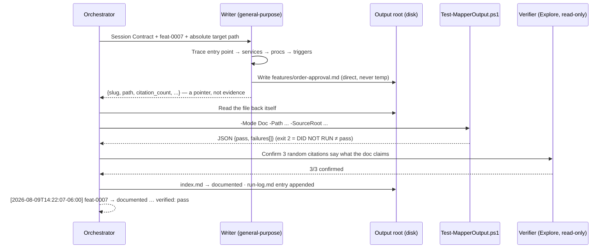

# legacy-dotnet-feature-mapper

Reverse-engineers a legacy .NET Framework 4.8 / .NET 5 WebForms + TSQL
application into a faithful, citable, feature-by-feature map — business rules,
permissions, happy/failure paths, DB behavior, and earned Mermaid diagrams —
using **static analysis only**. It never runs, builds, or executes the target
app. The output is a reference for a future rewrite team so that no feature or
business rule is silently lost.

**Version 2.0.0.** v2 exists because v1 could claim work it had not done. Every
completion gate is now backed by an artifact on disk and a mechanical check.

---

## The two rules everything else serves

1. **A completion claim is worthless without an artifact.** A feature is
   complete when a file exists, passes the manifest, and its citations point at
   real lines in real files — not when an agent says so.
2. **Deliverables live at the output root.** Temp and scratch paths are
   prohibited for output. Nothing that exists only in an agent's report counts
   as delivered.

---

## The typical flow

```mermaid
flowchart TD
    START([User asks to map a legacy app]) --> P0

    subgraph P0["PHASE 0 — Kickoff"]
        direction TB
        K1["Resolve session state<br/>.feature-mapper.json → memory → ask"]
        K2["Multiple-choice interview<br/>roots · SQL defs · output path"]
        K3["Resolve transitive project refs<br/>user prunes the scope ledger"]
        K4["Seed output tree<br/>print Session Contract"]
        K1 --> K2 --> K3 --> K4
    end

    P0 --> RECON["Reconcile answered questions<br/>questions-for-user.md"]
    RECON --> DISCCHK{"index.md exists and<br/>discovery_complete?"}

    DISCCHK -- no --> P1
    DISCCHK -- yes --> P2PLAN

    subgraph P1["PHASE 1 — Discovery"]
        direction TB
        D1["Explore subagents fan out<br/>one per root / major folder"]
        D2["Find entry points<br/>aspx · controllers · handlers · jobs<br/>queues · webhooks · orphan procs"]
        D3["Group into features · assign feat-IDs<br/>size each S / M / L"]
        D4["Write index.md + scan ledger<br/>partial coverage is recorded, not hidden"]
        D1 --> D2 --> D3 --> D4
    end

    P1 --> P2PLAN["Propose batches (multiple choice)<br/>3-slot budget · L=3 M=2 S=1<br/>always offer 'let me pick'"]

    P2PLAN --> P2

    subgraph P2["PHASE 2 — Deep-dive (parallel, per batch)"]
        direction TB
        W1["Print Session Contract"]
        W2["Dispatch general-purpose writers<br/>1 per feature, within slot budget"]
        W3["Each: entry point → business logic → DB<br/>copy templates/feature-doc.md and fill"]
        W4["Writer writes doc DIRECTLY to output root<br/>returns only a structured pointer"]
        W1 --> W2 --> W3 --> W4
    end

    P2 --> P3

    subgraph P3["PHASE 3 — Verification"]
        direction TB
        V1["Orchestrator reads the file from disk itself"]
        V2["Test-MapperOutput.ps1 -Mode Doc<br/>sections · placeholders · counts<br/>citation paths · line ranges"]
        V3["Explore verifier spot-checks<br/>3 random citations, read-only"]
        V1 --> V2 --> V3
    end

    P3 --> GATE{"Verified?"}
    GATE -- "fail, 1st time" --> RETRY["Feed failures back verbatim<br/>exactly one retry"]
    RETRY --> P2
    GATE -- "fail, 2nd time" --> FAILED["status: verification failed<br/>file a question · move on"]
    GATE -- pass --> P4

    FAILED --> P4

    subgraph P4["PHASE 4 — Rollup &amp; Report"]
        direction TB
        R1["Update index.md · run-log.md<br/>questions-for-user.md — immediately"]
        R2["Emit timestamped status line<br/>per feature"]
        R3["Batch sweep: -Mode Batch<br/>catches index rows with no file"]
        R4["Batch rollup + system-overview.md"]
        R1 --> R2 --> R3 --> R4
    end

    P4 --> MORE{"Endpoint condition met?"}
    MORE -- "no, more batches" --> P2PLAN
    MORE -- yes --> DONE([Final report:<br/>coverage · open questions · failures])

    STOP{{"Hard stops:<br/>output unwritable ·<br/>all roots missing ·<br/>3 consecutive verify failures"}} -.-> DONE
```



### A single feature, end to end



---

## Usage

### Starting a run

Ask, in the host conversation, to document / map / reverse-engineer / inventory
a legacy WebForms codebase. The skill activates on that intent, or on requests
to run "AFK", unattended, or "until done".

```text
Map the legacy billing app for me — I need it documented before the rewrite.
```

It will glob the workspace, then interview you with multiple choice (with an
"Other" escape on every question) for:

| Input | What it means |
|---|---|
| **Roots** | One or more paths. Everything at or below is fair game, and first-party project references are followed transitively. Folders are fine — `.csproj` paths are not required. |
| **SQL definitions folder** | Where the `.sql` schema/proc/trigger/view scripts live. |
| **Output docs path** | Where everything gets written. |

Then it shows you the **resolved transitive scope** and lets you uncheck
anything you do not care about — that set determines how big the whole job is,
so pruning it is the highest-leverage thing you do at kickoff.

### Attended vs unattended

```text
# attended — reports and pauses at batch boundaries
Deep-dive the Billing features next.

# unattended — needs an explicit endpoint condition
Run this AFK until every feature in the index is documented.
```

In AFK mode it works through batches without asking, files questions instead of
stalling on ambiguity, and stops only if the output path is unwritable, all
roots are missing, or three features fail verification in a row.

### Resuming

Just invoke it again in the same repo. It reads `.feature-mapper.json`, then
`index.md`, reconciles any questions you answered, and reports where things
stand before doing new work. Nothing already documented is redone.

### Answering questions

Anything only you can settle lands in `questions-for-user.md` with
multiple-choice options where possible. Fill in the `Answer:` line, set
`Status: answered`, and re-run — reconciliation is automatic. Blocking answers
re-derive the affected feature; non-blocking answers are patched in place.

### Running the validator yourself

```powershell
# one doc
./scripts/Test-MapperOutput.ps1 -Mode Doc `
    -Path docs/legacy-map/features/order-approval.md `
    -SourceRoot src,db/definitions

# the whole output tree, including index consistency
./scripts/Test-MapperOutput.ps1 -Mode Batch `
    -Path docs/legacy-map -SourceRoot src,db/definitions

# prove the validator itself still grades correctly
./scripts/Test-Validator.ps1
```

Exit codes: `0` pass, `1` failures found, `2` **the script could not run** —
which means validation did not happen and must never be read as a pass.

---

## What you get

```text
<output-docs-path>/
├── index.md                  # every feature: id, size, status, doc link, verification result
├── system-overview.md        # app-wide narrative + feature-relationship diagram
├── run-log.md                # forensic per-feature record (attended AND unattended)
├── questions-for-user.md     # deferred blockers, with multiple-choice options
├── features/
│   └── <feature-slug>.md     # purpose, permissions, happy path, business rules,
│                             #   failure states, DB interactions, open questions
└── shared-components/
    └── <component-slug>.md   # reused classes and DB objects + blast radius

<repo-root>/.feature-mapper.json   # committed, repo-relative paths, so a
                                   #   teammate or a later session resumes cleanly
```

Every factual claim carries a `file:line` citation and one of three confidence
tags: `verified in code`, `inferred from naming`, `unverified assumption`.

---

## Structure

```text
legacy-dotnet-feature-mapper/
├── SKILL.md                          # entry point — rules, phases, inputs
├── README.md                         # this file
├── templates/                        # copy these verbatim, then fill them
│   ├── feature-doc.md
│   ├── shared-component-doc.md
│   ├── index.md
│   ├── run-log.md
│   ├── questions-for-user.md
│   └── feature-mapper.json
├── references/
│   ├── kickoff-checklist.md          # Phase 0 — MC interview, scope ledger
│   ├── discovery-phase.md            # Phase 1 — index, sizing, scan ledger
│   ├── deep-dive-phase.md            # Phase 2 — tracing, writers, doc rules
│   ├── verification-phase.md         # Phase 3 — the gate, retries, fallback
│   ├── status-reporting.md           # Phase 4 — status lines, rollups, run log
│   ├── doc-manifest.md               # the enforced doc contract + manual checklist
│   ├── batching-and-agents.md        # sizing, slot budget, agent assignment
│   ├── session-state.md              # Session Contract, config file, memory
│   ├── questions-and-deferral.md     # defer-and-continue + reconciliation
│   ├── afk-mode.md                   # unattended loop and hard stops
│   ├── index-schema.md               # index.md / system-overview.md formats
│   ├── shared-components.md          # when and how to split out reused code
│   ├── tsql-analysis.md              # tracing logic through procs/views/triggers
│   ├── citation-and-confidence.md    # citation format + confidence tagging
│   └── migration-v1-to-v2.md         # migrating existing v1 output in place
└── scripts/
    ├── Test-MapperOutput.ps1         # the validator (Doc | Index | Batch)
    ├── Test-Validator.ps1            # 17 cases proving the validator grades correctly
    └── fixtures/                     # known-good source tree + docs to grade against
```

---

## Troubleshooting

Each of these is a failure this skill has actually produced. The mechanism that
now prevents it is named so you can check it is working.

### "It said Phase 2 was done, but nothing was written"

The classic ghost-completion. v1 marked features `documented` on the strength of
a self-checked checklist, so a run that did nothing passed every gate.

**Now prevented by:** the orchestrator reads each doc back from disk itself
(`verification-phase.md`), and `Test-MapperOutput.ps1 -Mode Index` fails any row
claiming completion with no file behind it (`doc-manifest.md` index rule 4).

**If it still happens:** check `run-log.md` for that feature. If the
verification block says `DID NOT RUN`, the validator was unavailable and the
manual fallback was skipped — re-run
`./scripts/Test-MapperOutput.ps1 -Mode Batch` yourself.

### "The work ended up in a temp file and never came back"

A subagent did the analysis and returned prose; the content evaporated in the
report channel.

**Now prevented by:** writers write final docs **directly** to the output root
and return only a structured pointer; temp/scratch is prohibited for
deliverables (`batching-and-agents.md`, `session-state.md`).

**If it still happens:** the writer prompt was missing the Session Contract.
Every subagent prompt must start with it.

### "Discovery stopped partway and I could not tell"

v1's index had no notion of how much of the codebase had been scanned, so a
half-finished map looked identical to a complete one — and the deep-dive
happily ran on it.

**Now prevented by:** the `scan_ledger` and `discovery_complete` flag in the
index frontmatter (`discovery-phase.md`). Phase 2 warns and names unscanned
areas; AFK finishes Discovery first.

**If it still happens:** check `discovery_complete` in `index.md`. If it is
`false`, ask for Discovery to be completed before any more deep-dives.

### "It wrote to the wrong folder" / "it forgot where output goes"

Context decay over a long run. The output path scrolled away and got
re-invented.

**Now prevented by:** the **Session Contract** re-printed at every batch start
and pasted into every subagent prompt, plus `.feature-mapper.json` at the repo
root and a skill memory as backstops (`session-state.md`).

**If it still happens:** check that `.feature-mapper.json` exists and its
`outputRoot` is right; it is the first thing consulted on a new session.

### "A citation pointed at a line that does not exist"

The most convincing kind of fabrication, because nobody checks line numbers by
hand.

**Now prevented by:** the validator resolves every cited path and compares every
cited line against the file's real line count, plus an `Explore` agent
spot-checks three citations semantically (`verification-phase.md`).

**If it still happens:** you probably ran without `-SourceRoot`. The report
marks those checks `skipped`, not passed — supply the roots and re-run.

### "It stalled on a question and did nothing for hours"

**Now prevented by:** defer-and-continue. Questions go to
`questions-for-user.md` and the run moves on (`questions-and-deferral.md`).
Only three things hard-stop a run: unwritable output, all roots missing, three
consecutive verification failures.

### "It ran for an hour and I had no idea what was happening"

**Now prevented by:** a timestamped status line per feature, a rollup per batch,
and a heartbeat inside anything running longer than ~10 minutes
(`status-reporting.md`).

### "The validator says a good doc is bad"

Possible — a validator that is wrong is worse than none. Run
`./scripts/Test-Validator.ps1`; it grades the validator against a known-good
fixture and 16 deliberately broken ones. If those 17 cases pass, the rules are
being applied as documented, and the doc genuinely violates
`references/doc-manifest.md`.

---

## Scope of the output

No modernization advice, no "you should refactor this", no opinions about the
new framework. This is a map of what the application does today — and every
line of it is meant to be checkable against the source.
