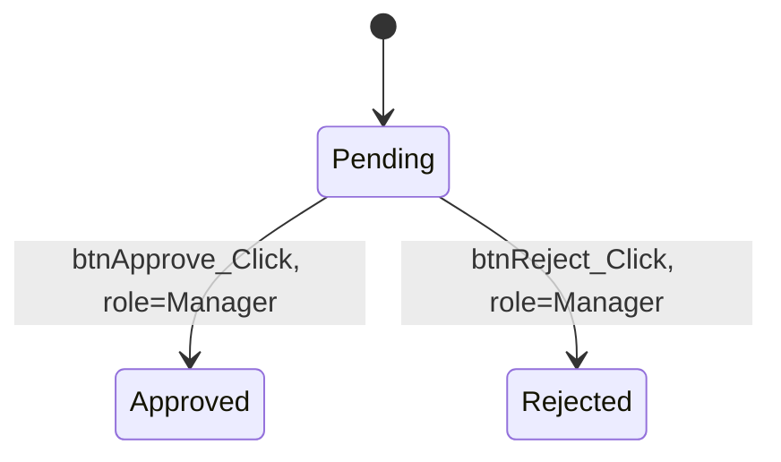

# Feature Doc Template

Save as `features/<feature-slug>.md`. Use kebab-case slugs derived from the feature name. Copy this structure; omit a section only if genuinely not applicable (state that explicitly rather than deleting silently, e.g. "No diagram - single linear path").

```markdown
---
id: feat-0001
slug: <feature-slug>
title: <Feature Name>
status: documented   # not started | in progress | documented | candidate orphan/scheduled proc, unconfirmed
trigger_type: user-initiated   # user-initiated | webhook | scheduled | queue-consumer | console/batch | db-scheduled (unconfirmed) |
domain: <inferred from folder/namespace, e.g. billing>
entry_points:
  - "<file path : method/page>"
csprojs:
  - <csproj file(s) this feature's code lives in>
last_updated: <date>
source_snapshot: "<git commit hash if available, otherwise 'file mtimes as of <date>'>"
confidence_summary:
  verified: <count>
  inferred: <count>
  unverified: <count>
db_objects:
   - <schema.table or proc/view/function names touched>
predecessors:
  - <feature id(s), or omit key if none>
successors:
  - <feature id(s), or omit key if none>
related_shared_components:
  - <shared-component id(s), or omit key if none>
has_diagram: true   # or false
open_questions_count: <count>
---
# <Feature Name>

**Status:** documented | in progress
**Last updated:** <date>
**Entry point(s):** <file path(s) : method/page - e.g. `Billing/OrderApproval.aspx.cs : btnApprove_Click`>
**Trigger type:** user-initiated | webhook | scheduled | queue-consumer | console/batch | db-scheduled (unconfirmed)

## Purpose

Plain-language summary of the business capability this feature provides. 2-4 sentences.

## Predecessors / Successors

- **Comes from:** <feature(s) that typically lead here, or "none found / entry point"> - `(confidence tag, citation)`. For `webhook` trigger type, use `external system: <name/URL if known>` instead of an internal feature.
- **Leads to:** <feature(s) this triggers/redirects to, or "none found / terminal"> - `(confidence tag, citation)`

## Authentication (webhook only)

Omit this section entirely for non-webhook trigger types. For webhooks, document how the inbound call is authenticated - API key, HMAC signature, IP allowlist, none found - with citation and confidence tag.

## Roles / Permissions

Who can take this action and how it's enforced.

- <Role/check> - `path/file.cs:123` `(verified in code)`
- If none found guarding an apparently sensitive action, state that plainly: "No authorization check found guarding this action" `(verified in code - absence confirmed by reading the full handler)`

## Happy Path

Step-by-step walkthrough of the normal successful flow, from entry point through to final DB state. Cite each step.

1. ...
2. ...

## Business Rules

Each rule as its own bullet, cited, with confidence tag.

- Rule description - `path/file.cs:45-52` `(verified in code)`
- Rule description - `(inferred from naming - method named ValidateCreditLimit, logic not fully traced due to X)`

## Failure States

What happens when things go wrong - validation failures, exceptions, edge cases.

- Condition → what happens (error shown / silent fail / logged / etc.) - citation, confidence tag

## Database Interactions

Table of touchpoints; deep TSQL findings link out to `shared-components/` docs where the object is reused elsewhere, or are described inline if feature-specific. See `tsql-analysis.md` for how these were traced.

| Object | Type | Read/Write | Notes | Citation | Confidence |
|---|---|---|---|---|---|
| `dbo.Orders` | Table | Read/Write | ... | `proc.sql:12` | verified in code |
| `usp_ApproveOrder` | Stored Proc | - | See [shared-components/usp-approve-order.md](../shared-components/usp-approve-order.md) | - | - |

## Diagram

(Only if it adds value - see deep-dive-phase.md. Otherwise write: "No diagram - [reason, e.g. single linear path with no branching]".)



## Open Questions / Unverified Items

Anything static analysis couldn't resolve, with a one-line reason.

- <item> - reason it couldn't be verified (e.g., "dynamic SQL built from config value, string not resolvable statically")

## Related Shared Components

- [shared-components/<slug>.md](../shared-components/<slug>.md) - one-line reason this feature depends on it
