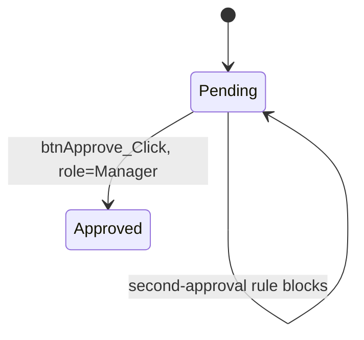

# Order Approval

**Status:** documented
**Last updated:** 2026-08-09
**Entry point(s):** `Billing/OrderApproval.aspx.cs : btnApprove_Click`
**Trigger type:** user-initiated

## Purpose

Lets a manager approve a pending order, moving it to Approved status and recording
an audit row. This fixture exists to exercise the validator against a document that
should pass every mechanical check.

## Predecessors / Successors

- **Comes from:** none found / entry point - `Billing/OrderApproval.aspx.cs:10` `(verified in code)`
- **Leads to:** the order list page - `Billing/OrderApproval.aspx.cs:38` `(verified in code)`

## Roles / Permissions

- Manager role required; non-managers are redirected away - `Billing/OrderApproval.aspx.cs:12-15` `(verified in code)`

## Happy Path

1. Page loads and enforces the Manager role check - `Billing/OrderApproval.aspx.cs:10-16` `(verified in code)`
2. Manager clicks Approve; the handler validates the order - `Billing/OrderApproval.aspx.cs:23` `(verified in code)`
3. The approval is written by the stored procedure - `usp_ApproveOrder.sql:9-14` `(verified in code)`

## Business Rules

- Orders over $10,000 without a second approval are rejected at the UI layer - `Billing/OrderApproval.aspx.cs:25-29` `(verified in code)`
- A stock availability gate is applied before approval, but the checking logic itself was not traced - `Billing/OrderApproval.aspx.cs:31` `(inferred from naming - CheckStock body is out of fixture scope)`
- Approval only succeeds when the order is still Pending - `usp_ApproveOrder.sql:14` `(verified in code)`

## Failure States

- Second-approval rule violated, an inline error message is shown and the handler returns - `Billing/OrderApproval.aspx.cs:27-28` `(verified in code)`
- Order is not Pending, the procedure raises an error and returns without writing - `usp_ApproveOrder.sql:16-20` `(verified in code)`

## Database Interactions

| Object | Type | Read/Write | Notes | Citation | Confidence |
|---|---|---|---|---|---|
| `dbo.Orders` | Table | Write | Status, ApprovedBy, ApprovedUtc set | `usp_ApproveOrder.sql:9-14` | verified in code |
| `dbo.OrderHistory` | Table | Write | Audit row appended after a successful update | `usp_ApproveOrder.sql:22-23` | verified in code |

## Diagram

## Open Questions / Unverified Items

- The per-region approval threshold cannot be resolved statically - `(unverified assumption - the AppSettings key is built by string concatenation at Billing/OrderApproval.aspx.cs:36)`

## Related Shared Components

- None - no component used by this fixture feature is shared with another feature.
