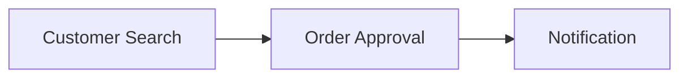

# System Overview

Last updated: <date>

## What this application does

<Plain-language summary of the app's purpose, built up from the features
documented so far. Say plainly when this is still incomplete - early on it will
be, and pretending otherwise is a false claim like any other.>

## Feature map

<Mermaid diagram showing how documented features relate: what feeds into what,
shared workflows, major modules. Update it incrementally. Covering only what is
documented so far is fine, with a note on what is not yet covered.>

Not yet covered: <areas still `not started` in index.md>

## Major shared components

<The most-depended-on shared-components/ docs - referenced by 3+ features.
These are the highest-blast-radius pieces of the old system.>

- [shared-components/<slug>.md](shared-components/<slug>.md) - used by N features

## Coverage

0 of 0 known features documented. 0 have open questions, 0 failed verification.
See [index.md](index.md) for full status.
