# mermaid-diagram-generator

Generates any Mermaid diagram type - flowchart through the newest beta/experimental
types - as standalone `.mermaid`/`.mmd` files or markdown-embedded ` ```mermaid `
blocks, targeting Mermaid v11.16.1.

## Contents

- [mermaid-diagram-generator](#mermaid-diagram-generator) skill
  - [Contents](#contents)
  - [Quick start](#quick-start)
  - [Updating](#updating)
  - [Structure](#structure)
    - [Diagram type coverage (30)](#diagram-type-coverage-30)
  - [Diagram glossary](#diagram-glossary)
    - [Stable](#stable)
      - [🟢 Flowchart](#-flowchart)
      - [🟢 Sequence](#-sequence)
      - [🟢 Class](#-class)
      - [🟢 State](#-state)
      - [🟢 GitGraph](#-gitgraph)
      - [🟢 User Journey](#-user-journey)
      - [🟢 Gantt](#-gantt)
      - [🟢 Pie Chart](#-pie-chart)
      - [🟢 Quadrant Chart](#-quadrant-chart)
      - [🟢 Requirement](#-requirement)
      - [🟢 Mindmap](#-mindmap)
      - [🟢 Timeline](#-timeline)
      - [🟢 ZenUML](#-zenuml)
    - [Beta](#beta)
      - [🟡 Sankey](#-sankey)
      - [🟡 Treemap](#-treemap)
      - [🟡 XY Chart](#-xy-chart)
      - [🟡 Block](#-block)
      - [🟡 Packet](#-packet)
      - [🟡 Kanban](#-kanban)
      - [🟡 Architecture](#-architecture)
      - [🟡 Radar](#-radar)
      - [🟡 Venn](#-venn)
      - [🟡 Ishikawa](#-ishikawa)
      - [🟡 Wardley](#-wardley)
      - [🟡 Cynefin](#-cynefin)
      - [🟡 TreeView](#-treeview)
      - [🟡 Swimlanes](#-swimlanes)
    - [Experimental](#experimental)
      - [🔴 Entity Relationship](#-entity-relationship)
      - [🔴 C4](#-c4)
      - [🔴 Event Modeling](#-event-modeling)
  - [Verification](#verification)


## Quick start

Just ask, in the host conversation, for a diagram - this skill activates on
requests like "draw a flowchart for...", "sequence diagram of...", or "make a
Mermaid diagram showing...". It will:

1. Match the request against `SKILL.md`'s decision table to pick a diagram type
   (asking first if 2-3 types plausibly fit).
2. Read that type's `references/<slug>.md` before writing any syntax.
3. Produce the diagram as a `.mmd` file (default for standalone output), a
   `.mermaid` file (if you name that extension), or a ` ```mermaid ` fenced block
   embedded in a markdown file (default when the target is a doc).
4. Call out explicitly when the chosen type is beta or experimental, since its
   syntax is more likely to shift on a future Mermaid upgrade.

A programmatic validator (`tools/validate-mermaid.mjs`) tests every example against Mermaid
v11.16.1 - structure checks, grammar validation, and full rendering. All 68 blocks pass grammar
validation (`--mode parse`); full browser rendering (`--mode render`) additionally registers the
ZenUML plugin for parse but not yet for render, so ZenUML's two blocks are the one case not fully
exercised end-to-end by this skill's own tooling (see the ZenUML entry in the glossary above).
For rendering details and integration with your workflow, see [`tools/README.md`](tools/README.md).

## Updating

mermaid.js.org content shifts between Mermaid releases. When bumping the pinned
version (currently v11.16.1, in `SKILL.md`'s frontmatter):

1. Re-fetch each changed diagram's page and diff against its `references/<slug>.md`
   - pay special attention to `keyword` (some beta types have dropped/added
   `-beta` suffixes between releases) and any new `mermaid_version_introduced`
   feature gates called out mid-file.
2. Bump `mermaid_version_verified` and `last_verified` in every file actually
   re-checked - don't bulk-update dates for files you didn't re-verify.
3. Re-run the verification pass below.

## Structure

```
mermaid-diagram-generator/
├── SKILL.md                       # Entry point - diagram-type index, decision table,
│                                   #   output-format patterns, self-check checklist
├── README.md                      # This file
└── references/
    ├── <slug>.md                  # One file per diagram type (30 total), each with
    │                               #   frontmatter (status/version/keyword/source/
    │                               #   gitlab_compatible) and the same 11-section
    │                               #   template (10 required + Platform compatibility)
    └── general/
        ├── configuration.md       # Global config resolution order
        ├── directives.md          # %%{init: {...}}%% syntax
        ├── theming.md             # Built-in themes and themeVariables
        ├── math.md                # KaTeX-based math rendering
        ├── accessibility.md       # accTitle/accDescr, generated ARIA output
        └── layout.md              # Layout engines (dagre/elk/etc.)
```

### Diagram type coverage (30)

| Status | Count | Types |
| --- | --- | --- |
| 🟢 Stable | 13 | flowchart, sequence, class, state, gitgraph, user-journey, gantt, pie, quadrant, requirement, mindmap, timeline, zenuml |
| 🟡 Beta | 14 | sankey, treemap, xy-chart, block, packet, kanban, architecture, radar, venn, ishikawa, wardley, cynefin, treeview, swimlanes |
| 🔴 Experimental | 3 | entity-relationship, c4, event-modeling |

Every `references/<slug>.md` file is independently frontmatter'd with its own
`status`, `mermaid_version_introduced`, `mermaid_version_verified`, and verified
`keyword` - statuses and keywords were confirmed against mermaid.js.org's raw page
source (not just WebFetch summaries, which were found to hallucinate syntax on
several newer pages during authoring), so don't assume a diagram's `-beta` suffix
convention without checking its file (e.g. `sankey`/`xychart`/`block` dropped the
suffix; `venn-beta`/`ishikawa-beta`/`wardley-beta` kept it).

## Diagram glossary

One example per diagram type - every block below is copied verbatim from that type's
`references/<slug>.md` "Simple example" section, so it stays in lockstep with the
reference docs and inherits the same validation (see Verification below). All 30 parse
cleanly under the automated checker's `--mode parse` (grammar/structure); full browser
rendering (`--mode render`) has not been exercised for every type in this environment -
see the ZenUML note below for the one type where that distinction currently matters.

### Stable

#### 🟢 Flowchart

**Use for:** Documenting a process, algorithm, or decision tree step by step. See [`references/flowchart.md`](references/flowchart.md) for full syntax, pitfalls, and a more complex example.

**Platforms:** GitLab ✅ · GitHub / VS Code / Obsidian / Notion — unconfirmed, verify in your target tool (see [`references/flowchart.md`](references/flowchart.md#platform-compatibility))

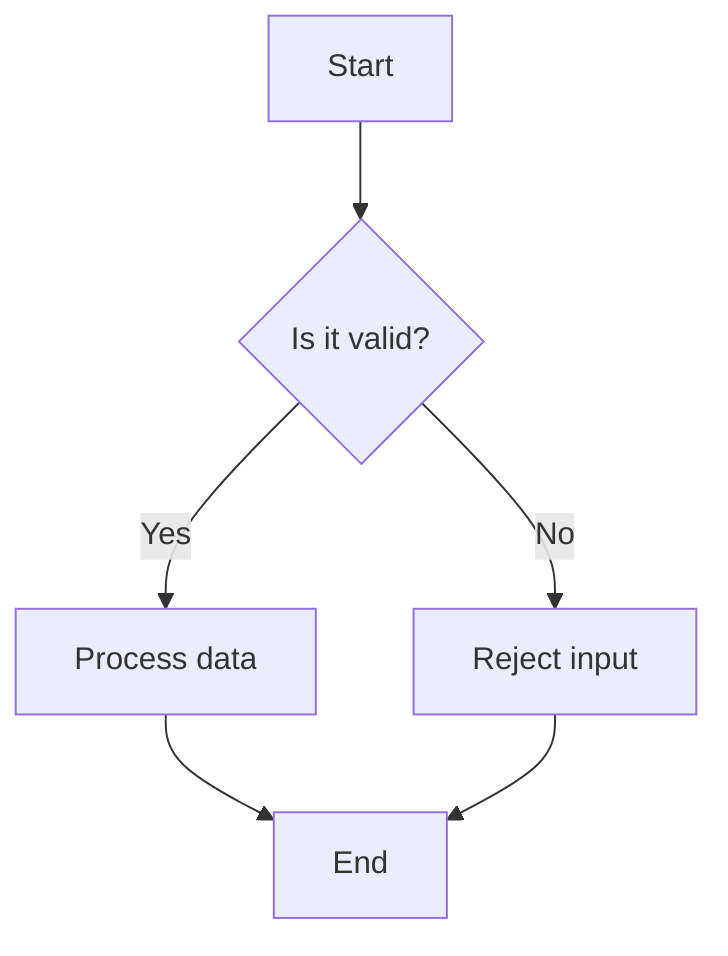

#### 🟢 Sequence

**Use for:** Documenting the order of calls or messages between services or actors. See [`references/sequence.md`](references/sequence.md) for full syntax, pitfalls, and a more complex example.

**Platforms:** GitLab ✅ · GitHub / VS Code / Obsidian / Notion — unconfirmed, verify in your target tool (see [`references/sequence.md`](references/sequence.md#platform-compatibility))

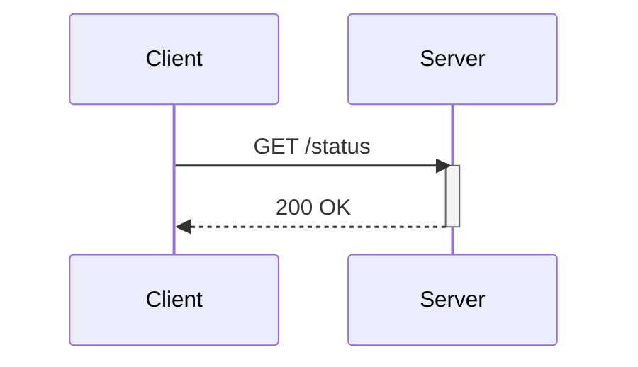

#### 🟢 Class

**Use for:** Documenting object-oriented type hierarchies and relationships between classes. See [`references/class.md`](references/class.md) for full syntax, pitfalls, and a more complex example.

**Platforms:** GitLab ✅ · GitHub / VS Code / Obsidian / Notion — unconfirmed, verify in your target tool (see [`references/class.md`](references/class.md#platform-compatibility))

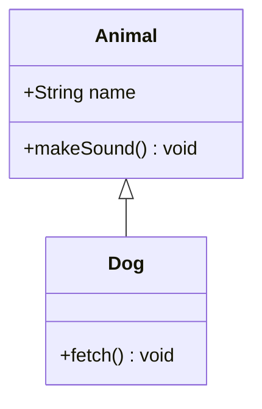

#### 🟢 State

**Use for:** Modeling a finite state machine's states and valid transitions. See [`references/state.md`](references/state.md) for full syntax, pitfalls, and a more complex example.

**Platforms:** GitLab ✅ · GitHub / VS Code / Obsidian / Notion — unconfirmed, verify in your target tool (see [`references/state.md`](references/state.md#platform-compatibility))

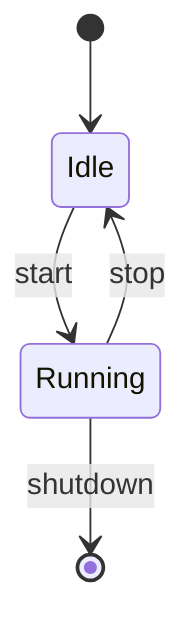

#### 🟢 GitGraph

**Use for:** Visualizing a repository's branching, merge, and commit history. See [`references/gitgraph.md`](references/gitgraph.md) for full syntax, pitfalls, and a more complex example.

**Platforms:** GitLab ✅ · GitHub / VS Code / Obsidian / Notion — unconfirmed, verify in your target tool (see [`references/gitgraph.md`](references/gitgraph.md#platform-compatibility))

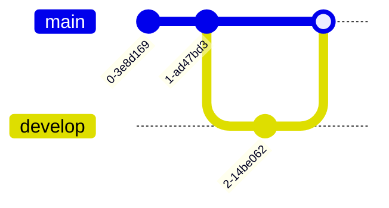

#### 🟢 User Journey

**Use for:** Visualizing satisfaction highs and lows across a user's path through a product. See [`references/user-journey.md`](references/user-journey.md) for full syntax, pitfalls, and a more complex example.

**Platforms:** GitLab ✅ · GitHub / VS Code / Obsidian / Notion — unconfirmed, verify in your target tool (see [`references/user-journey.md`](references/user-journey.md#platform-compatibility))

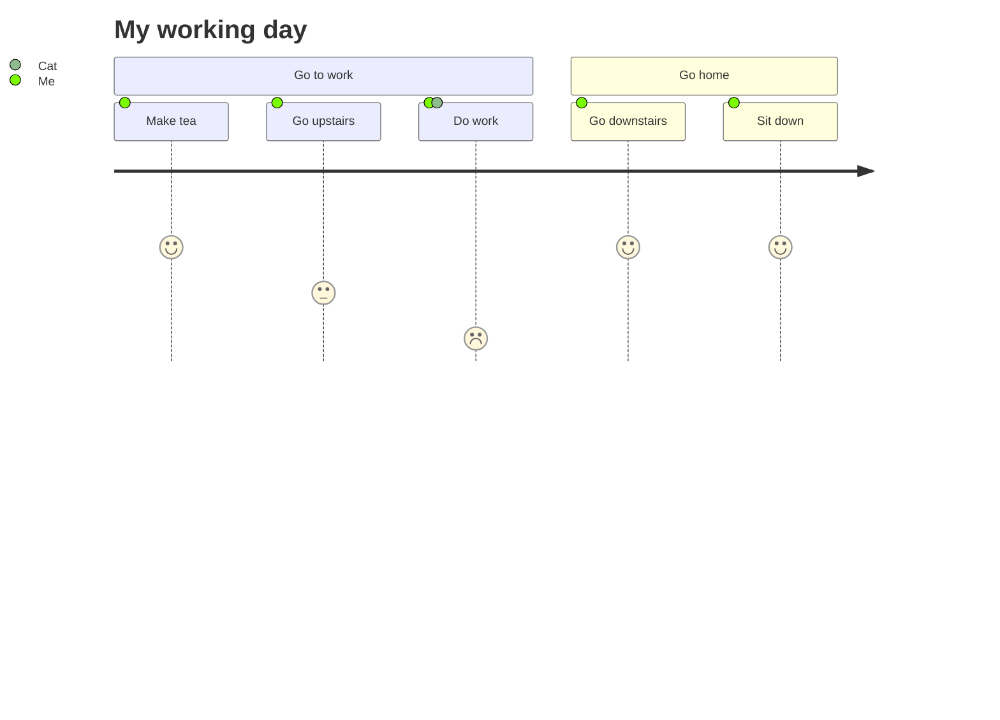

#### 🟢 Gantt

**Use for:** Project schedules where tasks have real dates/durations and dependencies. See [`references/gantt.md`](references/gantt.md) for full syntax, pitfalls, and a more complex example.

**Platforms:** GitLab ✅ · GitHub / VS Code / Obsidian / Notion — unconfirmed, verify in your target tool (see [`references/gantt.md`](references/gantt.md#platform-compatibility))

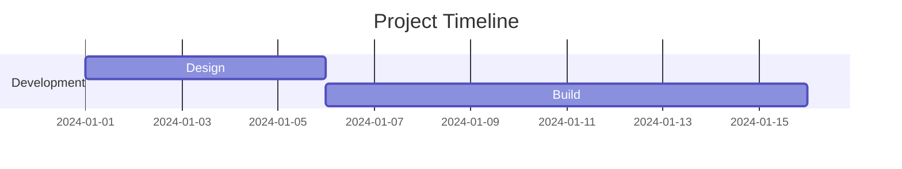

#### 🟢 Pie Chart

**Use for:** Showing relative share of a single total across a handful of categories. See [`references/pie.md`](references/pie.md) for full syntax, pitfalls, and a more complex example.

**Platforms:** GitLab ✅ · GitHub / VS Code / Obsidian / Notion — unconfirmed, verify in your target tool (see [`references/pie.md`](references/pie.md#platform-compatibility))

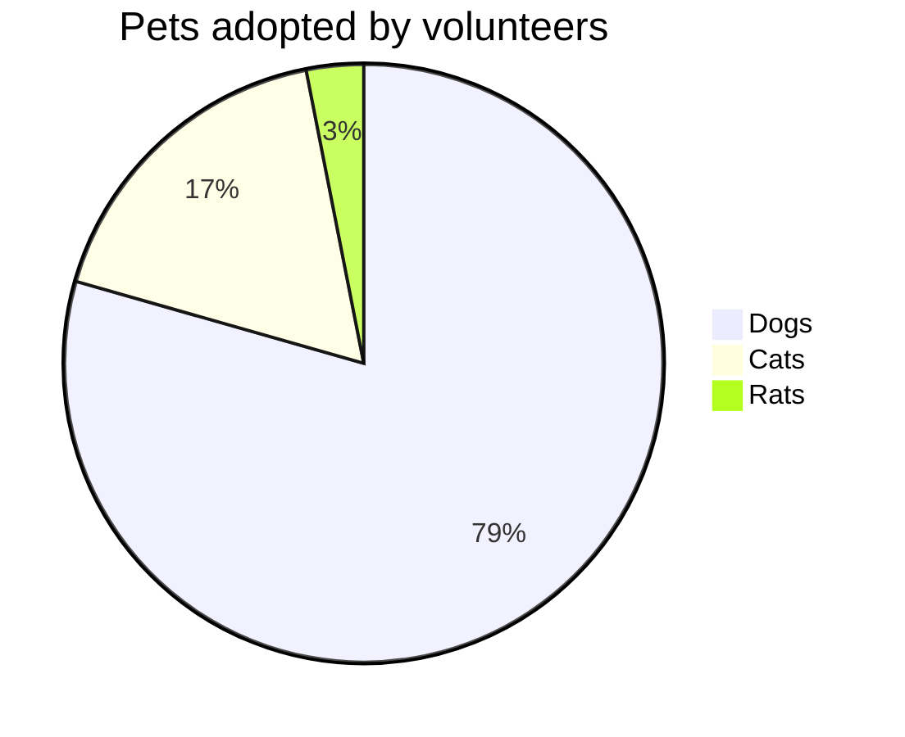

#### 🟢 Quadrant Chart

**Use for:** Prioritization matrices (Eisenhower grid, effort-vs-impact). See [`references/quadrant.md`](references/quadrant.md) for full syntax, pitfalls, and a more complex example.

**Platforms:** GitLab ✅ · GitHub / VS Code / Obsidian / Notion — unconfirmed, verify in your target tool (see [`references/quadrant.md`](references/quadrant.md#platform-compatibility))

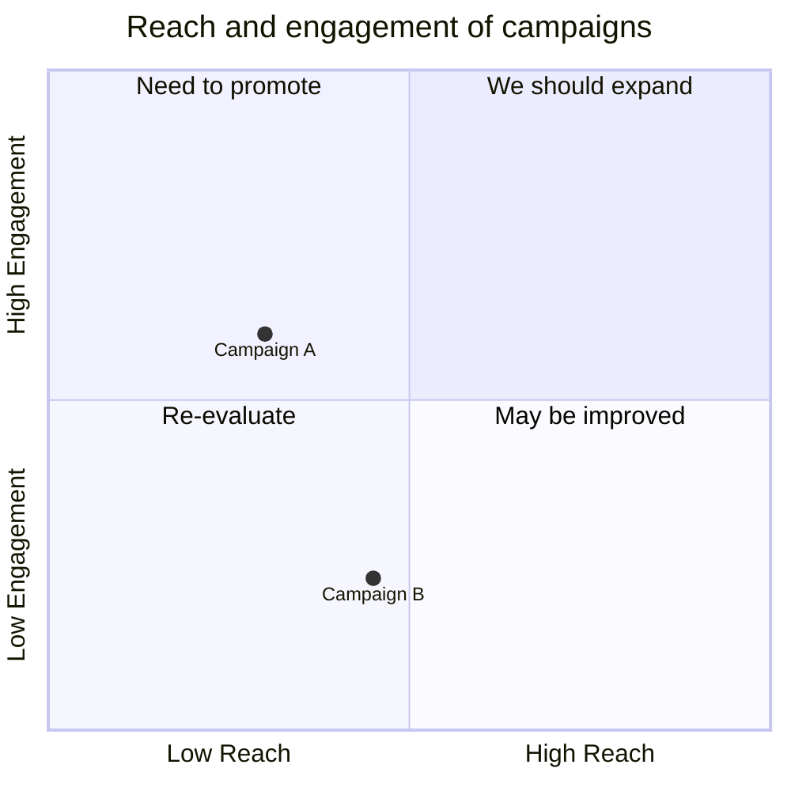

#### 🟢 Requirement

**Use for:** Tracing formal requirements to elements that satisfy or verify them. See [`references/requirement.md`](references/requirement.md) for full syntax, pitfalls, and a more complex example.

**Platforms:** GitLab ✅ · GitHub / VS Code / Obsidian / Notion — unconfirmed, verify in your target tool (see [`references/requirement.md`](references/requirement.md#platform-compatibility))

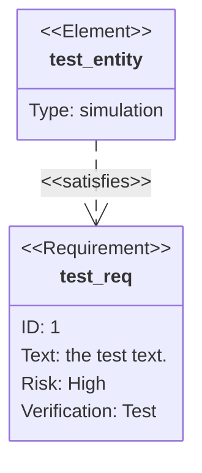

#### 🟢 Mindmap

**Use for:** Brainstorming or outlining ideas radiating from one central topic. See [`references/mindmap.md`](references/mindmap.md) for full syntax, pitfalls, and a more complex example.

**Platforms:** GitLab ✅ · GitHub / VS Code / Obsidian / Notion — unconfirmed, verify in your target tool (see [`references/mindmap.md`](references/mindmap.md#platform-compatibility))

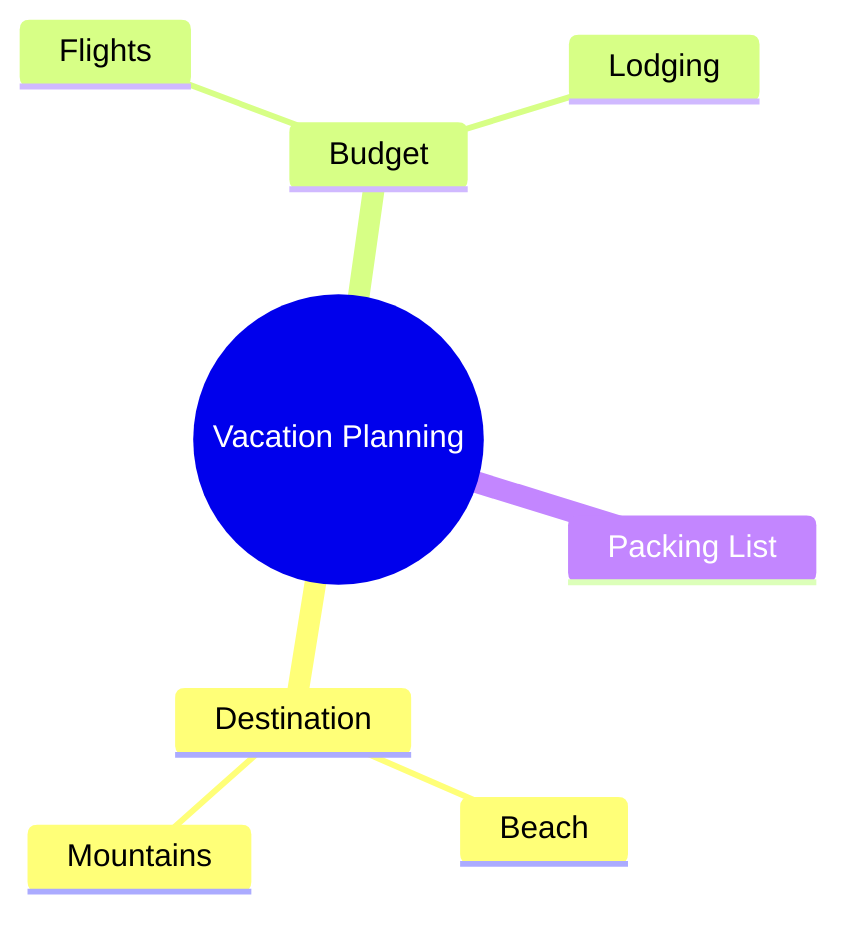

#### 🟢 Timeline

**Use for:** Telling a chronological story - history, milestones, eras. See [`references/timeline.md`](references/timeline.md) for full syntax, pitfalls, and a more complex example.

**Platforms:** GitLab ✅ · GitHub / VS Code / Obsidian / Notion — unconfirmed, verify in your target tool (see [`references/timeline.md`](references/timeline.md#platform-compatibility))

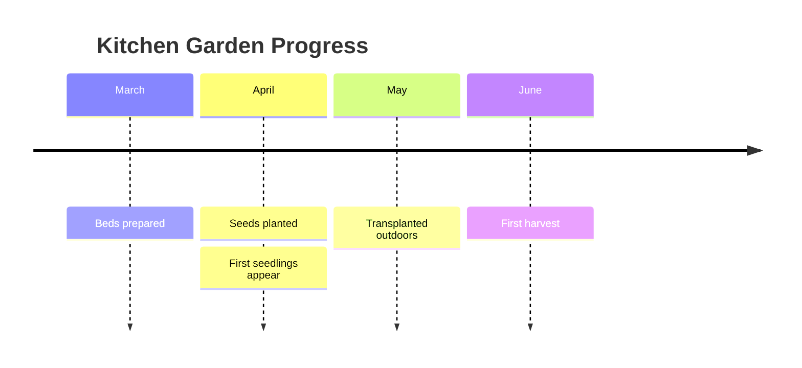

#### 🟢 ZenUML

**Use for:** Sequence diagrams where nested calls read like code (requires plugin). See [`references/zenuml.md`](references/zenuml.md) for full syntax, pitfalls, and a more complex example.

**Platforms:** GitLab ✅ · GitHub / VS Code / Obsidian / Notion — unconfirmed, verify in your target tool (see [`references/zenuml.md`](references/zenuml.md#platform-compatibility))

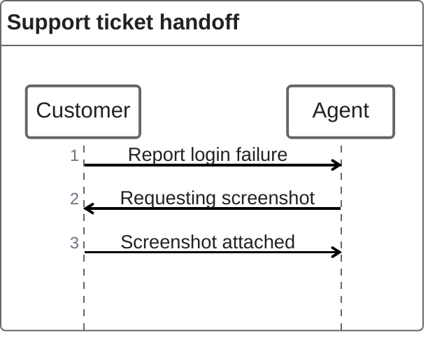

> ⚠️ Requires the `@mermaid-js/mermaid-zenuml` plugin to be registered before rendering - core Mermaid cannot parse this type at all otherwise. `tools/validate-mermaid.mjs` now registers the plugin and confirms this example parses cleanly under `--mode parse`, but `--mode render` (real browser) doesn't register the plugin yet, so full SVG rendering is unverified by this skill's tooling. Any *other* consuming tool (GitHub, a docs site, etc.) needs to register the plugin itself too - see `references/zenuml.md` for that caveat.

### Beta

#### 🟡 Sankey

**Use for:** How a quantity splits, merges, or drains across stages (funnels, budgets, energy). See [`references/sankey.md`](references/sankey.md) for full syntax, pitfalls, and a more complex example.

**Platforms:** GitLab ✅ · GitHub / VS Code / Obsidian / Notion — unconfirmed, verify in your target tool (see [`references/sankey.md`](references/sankey.md#platform-compatibility))

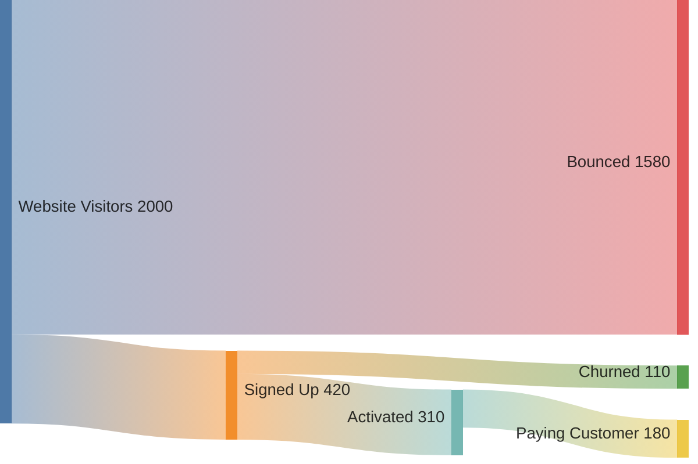

#### 🟡 Treemap

**Use for:** Part-to-whole proportions across a hierarchy. See [`references/treemap.md`](references/treemap.md) for full syntax, pitfalls, and a more complex example.

**Platforms:** GitLab ⚠️ not yet (introduced after GitLab.com's documented Mermaid v10 pin) · GitHub / VS Code / Obsidian / Notion — unconfirmed, verify in your target tool (see [`references/treemap.md`](references/treemap.md#platform-compatibility))

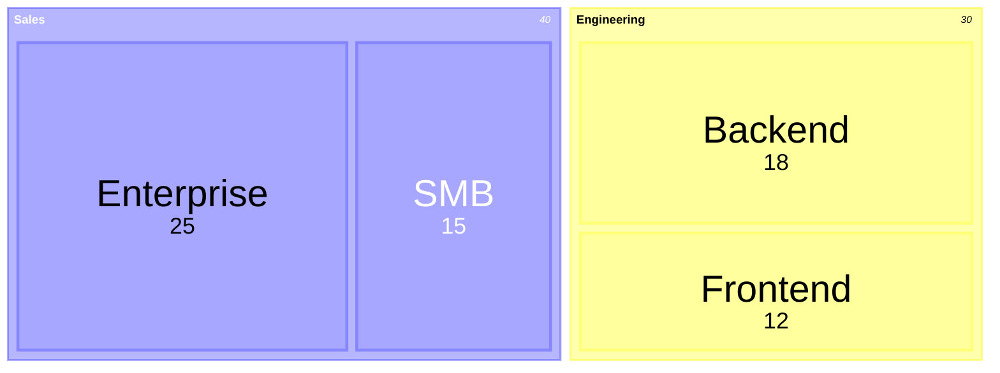

#### 🟡 XY Chart

**Use for:** Trends over time/ordered categories, line/bar/combo. See [`references/xy-chart.md`](references/xy-chart.md) for full syntax, pitfalls, and a more complex example.

**Platforms:** GitLab ✅ · GitHub / VS Code / Obsidian / Notion — unconfirmed, verify in your target tool (see [`references/xy-chart.md`](references/xy-chart.md#platform-compatibility))

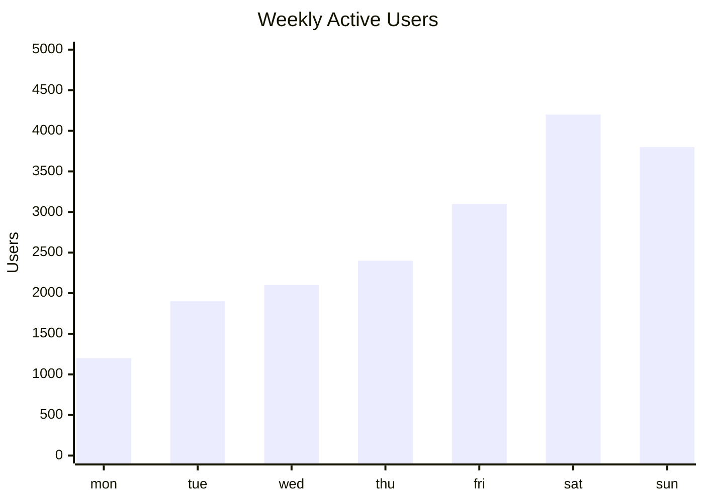

#### 🟡 Block

**Use for:** High-level architecture sketch where box position/grouping is intentional. See [`references/block.md`](references/block.md) for full syntax, pitfalls, and a more complex example.

**Platforms:** GitLab ✅ · GitHub / VS Code / Obsidian / Notion — unconfirmed, verify in your target tool (see [`references/block.md`](references/block.md#platform-compatibility))

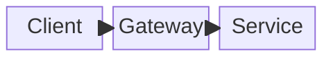

#### 🟡 Packet

**Use for:** Network protocol header layout, field-by-field, bit-accurate. See [`references/packet.md`](references/packet.md) for full syntax, pitfalls, and a more complex example.

**Platforms:** GitLab ⚠️ not yet (introduced after GitLab.com's documented Mermaid v10 pin) · GitHub / VS Code / Obsidian / Notion — unconfirmed, verify in your target tool (see [`references/packet.md`](references/packet.md#platform-compatibility))

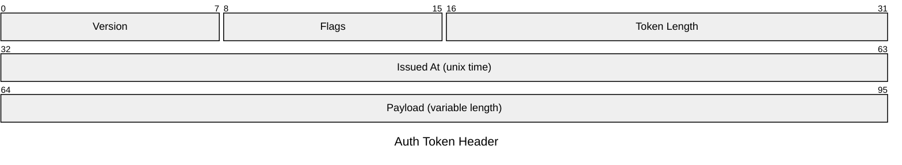

#### 🟡 Kanban

**Use for:** Snapshotting a team's current workflow state (Todo/In Progress/Done). See [`references/kanban.md`](references/kanban.md) for full syntax, pitfalls, and a more complex example.

**Platforms:** GitLab ⚠️ not yet (introduced after GitLab.com's documented Mermaid v10 pin) · GitHub / VS Code / Obsidian / Notion — unconfirmed, verify in your target tool (see [`references/kanban.md`](references/kanban.md#platform-compatibility))

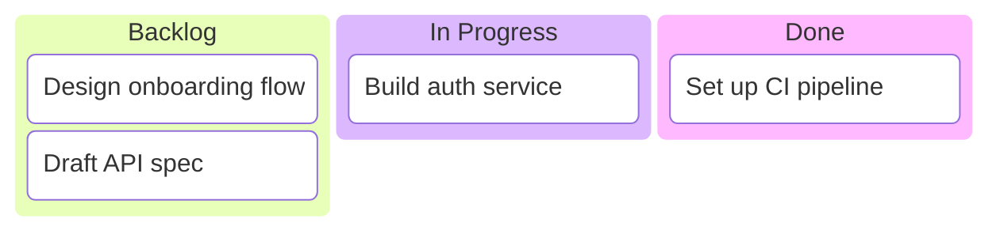

#### 🟡 Architecture

**Use for:** Cloud/CI-CD deployment topology - services, storage, connections. See [`references/architecture.md`](references/architecture.md) for full syntax, pitfalls, and a more complex example.

**Platforms:** GitLab ⚠️ not yet (introduced after GitLab.com's documented Mermaid v10 pin) · GitHub / VS Code / Obsidian / Notion — unconfirmed, verify in your target tool (see [`references/architecture.md`](references/architecture.md#platform-compatibility))

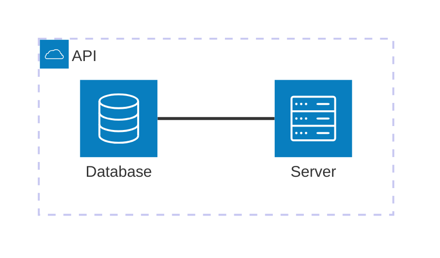

#### 🟡 Radar

**Use for:** Comparing multiple items across 3+ shared criteria. See [`references/radar.md`](references/radar.md) for full syntax, pitfalls, and a more complex example.

**Platforms:** GitLab ⚠️ not yet (introduced after GitLab.com's documented Mermaid v10 pin) · GitHub / VS Code / Obsidian / Notion — unconfirmed, verify in your target tool (see [`references/radar.md`](references/radar.md#platform-compatibility))

```mermaid
radar-beta
  title Skill Comparison
  axis speed["Speed"], power["Power"], defense["Defense"]
  axis stamina["Stamina"]

  curve hero["Hero"]{8, 6, 7, 9}
  curve rival["Rival"]{6, 9, 5, 6}

  max 10
```

#### 🟡 Venn

**Use for:** Showing which categories/groups share members. See [`references/venn.md`](references/venn.md) for full syntax, pitfalls, and a more complex example.

**Platforms:** GitLab ⚠️ not yet (introduced after GitLab.com's documented Mermaid v10 pin) · GitHub / VS Code / Obsidian / Notion — unconfirmed, verify in your target tool (see [`references/venn.md`](references/venn.md#platform-compatibility))

```mermaid
venn-beta
  title "Team overlap"
  set Frontend
  set Backend
  union Frontend,Backend["APIs"]
```

#### 🟡 Ishikawa

**Use for:** Root-cause analysis of a single defined problem or incident. See [`references/ishikawa.md`](references/ishikawa.md) for full syntax, pitfalls, and a more complex example.

**Platforms:** GitLab ⚠️ not yet (introduced after GitLab.com's documented Mermaid v10 pin) · GitHub / VS Code / Obsidian / Notion — unconfirmed, verify in your target tool (see [`references/ishikawa.md`](references/ishikawa.md#platform-compatibility))

```mermaid
ishikawa-beta
    Late Deployment
    Process
        No staging environment
        Manual approval bottleneck
    People
        Key reviewer on leave
```

#### 🟡 Wardley

**Use for:** Strategic value-chain mapping for build/buy/outsource reasoning. See [`references/wardley.md`](references/wardley.md) for full syntax, pitfalls, and a more complex example.

**Platforms:** GitLab ⚠️ not yet (introduced after GitLab.com's documented Mermaid v10 pin) · GitHub / VS Code / Obsidian / Notion — unconfirmed, verify in your target tool (see [`references/wardley.md`](references/wardley.md#platform-compatibility))

```mermaid
wardley-beta
title Coffee Shop Value Chain

anchor Customer [0.90, 0.90]
component Cup of Coffee [0.75, 0.65]
component Beans [0.55, 0.40]
component Roaster [0.35, 0.20]

Customer -> Cup of Coffee
Cup of Coffee -> Beans
Beans -> Roaster
```

#### 🟡 Cynefin

**Use for:** Classifying problems by how well-understood their cause-and-effect is. See [`references/cynefin.md`](references/cynefin.md) for full syntax, pitfalls, and a more complex example.

**Platforms:** GitLab ⚠️ not yet (introduced after GitLab.com's documented Mermaid v10 pin) · GitHub / VS Code / Obsidian / Notion — unconfirmed, verify in your target tool (see [`references/cynefin.md`](references/cynefin.md#platform-compatibility))

```mermaid
cynefin-beta
  title Incident Triage

  clear
    "Restart the service"
    "Apply documented fix"

  complicated
    "Escalate to on-call expert"

  complex
    "Run a small experiment"

  chaotic
    "Stop the bleeding first"
```

#### 🟡 TreeView

**Use for:** Rendering a file/folder structure or codebase layout. See [`references/treeview.md`](references/treeview.md) for full syntax, pitfalls, and a more complex example.

**Platforms:** GitLab ⚠️ not yet (introduced after GitLab.com's documented Mermaid v10 pin) · GitHub / VS Code / Obsidian / Notion — unconfirmed, verify in your target tool (see [`references/treeview.md`](references/treeview.md#platform-compatibility))

```mermaid
treeView-beta
    "my-project/"
        "src/"
            "index.js"
            "utils.js"
        "package.json"
        "README.md"
```

#### 🟡 Swimlanes

**Use for:** A process where step ownership matters as much as sequence. See [`references/swimlanes.md`](references/swimlanes.md) for full syntax, pitfalls, and a more complex example.

**Platforms:** GitLab ⚠️ not yet (introduced after GitLab.com's documented Mermaid v10 pin) · GitHub / VS Code / Obsidian / Notion — unconfirmed, verify in your target tool (see [`references/swimlanes.md`](references/swimlanes.md#platform-compatibility))

```mermaid
swimlane-beta LR
  subgraph Customer
    request[Request service]
    receive[Receive update]
  end

  subgraph Support
    triage[Triage request]
    answer[Send answer]
  end

  request --> triage
  triage -->|Known issue| answer
  answer --> receive
```

### Experimental

#### 🔴 Entity Relationship

**Use for:** Sketching a database schema with tables and cardinalities. See [`references/entity-relationship.md`](references/entity-relationship.md) for full syntax, pitfalls, and a more complex example.

**Platforms:** GitLab ✅ · GitHub / VS Code / Obsidian / Notion — unconfirmed, verify in your target tool (see [`references/entity-relationship.md`](references/entity-relationship.md#platform-compatibility))

```mermaid
erDiagram
    CUSTOMER ||--o{ ORDER : places
    ORDER ||--|{ LINE-ITEM : contains
```

#### 🔴 C4

**Use for:** System architecture at context/container/component zoom using C4 vocabulary. See [`references/c4.md`](references/c4.md) for full syntax, pitfalls, and a more complex example.

**Platforms:** GitLab ✅ · GitHub / VS Code / Obsidian / Notion — unconfirmed, verify in your target tool (see [`references/c4.md`](references/c4.md#platform-compatibility))

```mermaid
C4Context
    title System Context for Internet Banking System

    Person(customer, "Customer", "A user of the bank's services")
    System(banking, "Internet Banking System", "Lets customers view balances and make payments")
    System_Ext(email, "E-mail System", "Sends transaction notifications")

    Rel(customer, banking, "Uses")
    Rel(banking, email, "Sends e-mail using")
```

#### 🔴 Event Modeling

**Use for:** Narrating a use case: user action → command → event(s) → read model. See [`references/event-modeling.md`](references/event-modeling.md) for full syntax, pitfalls, and a more complex example.

**Platforms:** GitLab ⚠️ not yet (introduced after GitLab.com's documented Mermaid v10 pin) · GitHub / VS Code / Obsidian / Notion — unconfirmed, verify in your target tool (see [`references/event-modeling.md`](references/event-modeling.md#platform-compatibility))

```mermaid
eventmodeling
tf 01 ui CartUI {select item}
tf 02 cmd AddItem {item id, quantity}
tf 03 evt ItemAdded {item id, quantity, cart id}
```

> ⚠️ Experimental - Mermaid's newest diagram type (v11.15.0+), so its syntax is more likely than stable types to change in a future release. It parses cleanly under `--mode parse` against the pinned version.

## Verification

Automated validation with the bundled tool - instant structure checks, or full rendering with puppeteer:

```bash
# Structure + keyword + version checks (no dependencies; ~1s)
node tools/validate-mermaid.mjs --mode none

# Parse-only check (fast; mermaid + jsdom; ~2-5s)
node tools/validate-mermaid.mjs --mode parse

# Full render validation (mermaid + puppeteer; ~15-25s)
node tools/validate-mermaid.mjs
```

All 68 diagram examples pass grammar validation (`--mode parse`), with none skipped - including ZenUML (plugin registered by the validator itself) and Event Modeling (both examples were fixed to match confirmed-working syntax; the type remains experimental upstream, but the examples themselves parse cleanly). See [`tools/README.md`](tools/README.md) for detailed usage, manual validation fallbacks, and CI integration examples.
