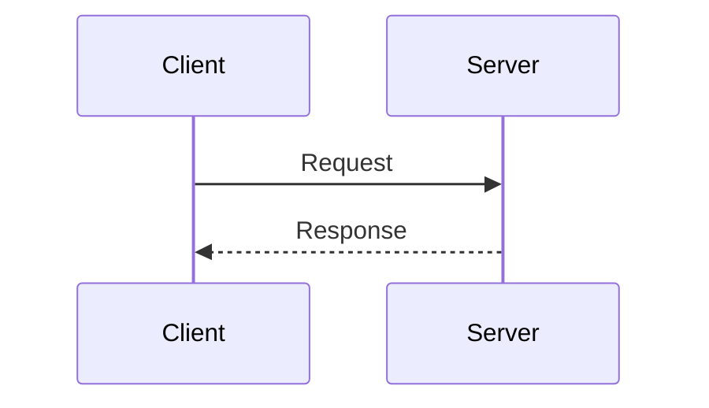

# Mermaid Diagram Generator

Generates any Mermaid diagram type against **Mermaid v11.16.1** syntax. Cardinal rule: **always read the matching `references/<slug>.md` file before writing that diagram type's syntax** - never generate beta or experimental syntax from memory alone, since those are the types most likely to have drifted since this skill was written.

## Before you generate anything

1. **Resolve the diagram type.** Use the decision table below. If 2-3 types plausibly fit, name the candidates and ask the user to pick - don't guess silently.
2. **Resolve the output format.** Standalone `.mermaid`/`.mmd` file, or markdown-embedded? See "Output formats" below; ask if the target isn't clear from context.
3. **Read `references/<slug>.md` for that diagram type first.** It has the verified keyword, current syntax, examples, and pitfalls - don't rely on general Mermaid knowledge for anything beyond the most common stable types.

## Choosing a diagram type

| User says something like...                                                            | Suggest                                 | Reference                       |
| -------------------------------------------------------------------------------------- | --------------------------------------- | ------------------------------- |
| "brainstorm", "nested idea breakdown from one topic"                                   | Mindmap                                 | `mindmap.md`                    |
| "chronological history of events/eras"                                                 | Timeline                                | `timeline.md`                   |
| "class structure", "OOP relationships", "interfaces/inheritance"                       | Class                                   | `class.md`                      |
| "classify a problem by how well-understood it is" (simple/complicated/complex/chaotic) | Cynefin (beta)                          | `cynefin.md`                    |
| "cloud/CI-CD/service architecture, boxes + connections"                                | Architecture (beta)                     | `architecture.md`               |
| "compare items across 3+ shared criteria", "spider/skills comparison"                  | Radar (beta)                            | `radar.md`                      |
| "compare items on two axes", "prioritization/effort-vs-impact matrix"                  | Quadrant                                | `quadrant.md`                   |
| "database schema", "tables and relationships"                                          | Entity Relationship (experimental)      | `entity-relationship.md`        |
| "file/folder structure", "directory listing", "codebase layout"                        | TreeView (beta)                         | `treeview.md`                   |
| "formal requirements traceability"                                                     | Requirement                             | `requirement.md`                |
| "generic boxes-and-arrows infra sketch, position matters"                              | Block (beta)                            | `block.md`                      |
| "git branch/commit/merge history"                                                      | GitGraph                                | `gitgraph.md`                   |
| "how a quantity splits/merges/drains across stages" (funnels, budget, energy)          | Sankey (beta)                           | `sankey.md`                     |
| "narrate a use case as action → command → event → read model"                          | Event Modeling (experimental)           | `event-modeling.md`             |
| "network packet/byte/header layout"                                                    | Packet (beta)                           | `packet.md`                     |
| "numeric trend over time/categories", "bar+line combo chart"                           | XY Chart (beta)                         | `xy-chart.md`                   |
| "part-to-whole across a hierarchy" (budget by dept by item, disk usage)                | Treemap (beta)                          | `treemap.md`                    |
| "process where ownership/team/role matters per step"                                   | Swimlanes (or Flowchart with subgraphs) | `swimlanes.md` / `flowchart.md` |
| "project schedule", "tasks over time with dependencies"                                | Gantt                                   | `gantt.md`                      |
| "proportion of a whole", "percentage breakdown"                                        | Pie                                     | `pie.md`                        |
| "root-cause analysis", "fishbone diagram"                                              | Ishikawa (beta)                         | `ishikawa.md`                   |
| "satisfaction/happiness across steps of an experience"                                 | User Journey                            | `user-journey.md`               |
| "sequence diagram but nested calls read like code"                                     | ZenUML (needs plugin)                   | `zenuml.md`                     |
| "states a thing moves through", "state machine"                                        | State                                   | `state.md`                      |
| "steps in a process", "workflow", "decision logic", "algorithm"                        | Flowchart                               | `flowchart.md`                  |
| "strategic value-chain / build-buy-outsource mapping"                                  | Wardley (beta)                          | `wardley.md`                    |
| "system context/container/component diagram (C4-style)"                                | C4 (experimental)                       | `c4.md`                         |
| "task board", "Todo/In Progress/Done"                                                  | Kanban (beta)                           | `kanban.md`                     |
| "which groups/categories share members"                                                | Venn (beta)                             | `venn.md`                       |
| "who calls whom, in order", "API call sequence", "message exchange"                    | Sequence                                | `sequence.md`                   |

If a request plausibly matches 2-3 rows (e.g. "show relationships between teams" could be Flowchart+subgraphs, Swimlanes, or Class), name the candidates briefly and ask rather than picking silently. **Always mention when the chosen type is beta or experimental before generating it** - the user should know the syntax may need adjustment.

## Diagram type index

Status badges: 🟢 stable · 🟡 beta (syntax may evolve) · 🔴 experimental (syntax/support may change more than beta).

### Stable

| Diagram           | Summary & best fit                                                             | Reference         |
| ----------------- | ------------------------------------------------------------------------------ | ----------------- |
| 🟢 Flowchart      | Documenting a process, algorithm, or decision tree step by step                | `flowchart.md`    |
| 🟢 Sequence       | Documenting the order of calls or messages between services or actors          | `sequence.md`     |
| 🟢 Class          | Documenting object-oriented type hierarchies and relationships between classes | `class.md`        |
| 🟢 State          | Modeling a finite state machine's states and valid transitions                 | `state.md`        |
| 🟢 GitGraph       | Visualizing a repository's branching, merge, and commit history                | `gitgraph.md`     |
| 🟢 User Journey   | Visualizing satisfaction highs and lows across a user's path through a product | `user-journey.md` |
| 🟢 Gantt          | Project schedules where tasks have real dates/durations and dependencies       | `gantt.md`        |
| 🟢 Pie Chart      | Showing relative share of a single total across a handful of categories        | `pie.md`          |
| 🟢 Quadrant Chart | Prioritization matrices (Eisenhower grid, effort-vs-impact)                    | `quadrant.md`     |
| 🟢 Requirement    | Tracing formal requirements to elements that satisfy or verify them            | `requirement.md`  |
| 🟢 Mindmap        | Brainstorming or outlining ideas radiating from one central topic              | `mindmap.md`      |
| 🟢 Timeline       | Telling a chronological story - history, milestones, eras                      | `timeline.md`     |
| 🟢 ZenUML         | Sequence diagrams where nested calls read like code (requires plugin)          | `zenuml.md`       |

### Beta

| Diagram         | Summary & best fit                                                                | Reference         |
| --------------- | --------------------------------------------------------------------------------- | ----------------- |
| 🟡 Sankey       | How a quantity splits, merges, or drains across stages (funnels, budgets, energy) | `sankey.md`       |
| 🟡 Treemap      | Part-to-whole proportions across a hierarchy                                      | `treemap.md`      |
| 🟡 XY Chart     | Trends over time/ordered categories, line/bar/combo                               | `xy-chart.md`     |
| 🟡 Block        | High-level architecture sketch where box position/grouping is intentional         | `block.md`        |
| 🟡 Packet       | Network protocol header layout, field-by-field, bit-accurate                      | `packet.md`       |
| 🟡 Kanban       | Snapshotting a team's current workflow state (Todo/In Progress/Done)              | `kanban.md`       |
| 🟡 Architecture | Cloud/CI-CD deployment topology - services, storage, connections                  | `architecture.md` |
| 🟡 Radar        | Comparing multiple items across 3+ shared criteria                                | `radar.md`        |
| 🟡 Venn         | Showing which categories/groups share members                                     | `venn.md`         |
| 🟡 Ishikawa     | Root-cause analysis of a single defined problem or incident                       | `ishikawa.md`     |
| 🟡 Wardley      | Strategic value-chain mapping for build/buy/outsource reasoning                   | `wardley.md`      |
| 🟡 Cynefin      | Classifying problems by how well-understood their cause-and-effect is             | `cynefin.md`      |
| 🟡 TreeView     | Rendering a file/folder structure or codebase layout                              | `treeview.md`     |
| 🟡 Swimlanes    | A process where step _ownership_ matters as much as sequence                      | `swimlanes.md`    |

### Experimental

| Diagram                | Summary & best fit                                                          | Reference                |
| ---------------------- | --------------------------------------------------------------------------- | ------------------------ |
| 🔴 Entity Relationship | Sketching a database schema with tables and cardinalities                   | `entity-relationship.md` |
| 🔴 C4                  | System architecture at context/container/component zoom using C4 vocabulary | `c4.md`                  |
| 🔴 Event Modeling      | Narrating a use case: user action → command → event(s) → read model         | `event-modeling.md`      |

## Output formats

**Pattern A - standalone `.mermaid` file.** Raw diagram source, starting directly with the diagram keyword, no code fence, no frontmatter:

```
flowchart TD
    A[Start] --> B{Decision}
    B -->|Yes| C[Do thing]
    B -->|No| D[Skip]
```

Use when the user names this extension explicitly, or an existing project convention already uses it.

**Pattern B - standalone `.mmd` file.** Byte-identical convention to Pattern A, different extension. This is the more common extension for `mmdc` (mermaid-cli) and VS Code Mermaid tooling. **Default to `.mmd`** when the user wants a diagram as its own file and hasn't named an extension.

**Pattern C - markdown-embedded fenced block.** Inside a `.md` file, wrap with a ` ```mermaid ` fence:

````

````

**Default to Pattern C** when the target is an existing or new markdown document. If the diagram's own content needs to display a literal triple-backtick sequence (rare - e.g. documenting fenced output), bump the _outer_ fence to 4 backticks so the inner one doesn't close it early.

## Escaping & markdown-safety quick rules

- Quote any node/edge label containing `:`, `#`, `"`, `|`, `(`, `)`, `<`, `>` - default to wrapping the whole label in double quotes when unsure. Diagram-specific exceptions are called out in each reference file's "Escaping & special characters" section.
- Never let a literal ` ``` ` sequence appear inside label text destined for a ```mermaid fence.
- Comments use `%%` and must never appear inside a quoted label.
- When embedding in markdown, make sure no blank line + unindented text inside the fence accidentally looks like it closes the block.
- A literal double quote _inside_ an already-quoted label usually has no simple escape** - most diagram families (flowchart, sequence, state) fall back to HTML entity codes for punctuation that collides with the grammar even when quoted, e.g. `#quot;`/`&quot;` for `"`, `#35;` for `#`, `&lt;`/`&gt;` for angle brackets. A few types use a different convention instead - Sankey's CSV-style fields double the quote (`""`) rather than using an entity code. Check the specific type's "Escaping & special characters" section rather than assuming one convention applies everywhere.
- Delimiter collisions beyond quoting: several diagram types use a bare `:` or `,` as a hard field separator outside of any label-quoting mechanism - a Gantt task's `:`, a User Journey task's `:`/`,`, Sankey/CSV-style rows' `,`. Quoting the _label_ doesn't always protect these - re-read the specific type's basic syntax for where the character is structural rather than decorative before assuming it's escapable at all.
- The bare word `end` isn't just a reserved id (see the self-check list below) - in Flowchart and Sequence specifically, `end` appearing as literal label/message _text_ (not just as a node id) can also be misread as a block terminator; wrap it, e.g. `(end)`, `[end]`, or `{end}`.
- Long labels don't auto-wrap on a literal newline - Mermaid labels are single-line by default; force a line break inside a label with `<br/>` (or `<br>`) rather than embedding a raw newline, which most diagram types either collapse or fail to parse. Mindmap is the one documented exception that offers automatic wrapping, via its backtick markdown-string label form.
- A `---`-fenced YAML config block above the diagram keyword is a separate escaping context from the diagram body - several types (Pie, Quadrant, Radar, Sankey, Timeline, and others) support one for `config`/`themeVariables` overrides. It's parsed as plain YAML, not Mermaid syntax, so YAML's own quoting rules apply: quote any string value containing `:` or other YAML-special characters, independently of how you'd quote that same text inside the diagram body.
- Some diagram types are structurally indentation-sensitive (Mindmap, Timeline, Kanban, TreeView, Ishikawa) - a line's leading whitespace determines nesting/depth, not just readability. A markdown renderer, linter, or editor that dedents or auto-trims trailing whitespace inside a fenced block can silently corrupt the diagram's structure for these types. Preserve indentation byte-for-byte when moving these diagrams between files.

## Self-check before delivering a diagram

When generating a diagram **within this repository**, prefer the automated validator (`tools/validate-mermaid.mjs`):

- `node tools/validate-mermaid.mjs --mode parse` - fast grammar check (no browser)
- `node tools/validate-mermaid.mjs` - full validation including rendering

When generating a diagram **outside this repo** (in a user's codebase), this tool is unavailable, so use this manual checklist:

1. Diagram keyword is the first non-blank token, exact casing/suffix as documented for that type (e.g. `sankey` not `sankey-beta`, but `venn-beta` not `venn` - verified per-file, don't assume a pattern).
2. Every opened `[`, `(`, `{`, `"`, `<<` has a matching close.
3. Node/actor/participant IDs don't collide with reserved words for that diagram family (`end`, `graph`, `class`, `click`, `style`, `subgraph`).
4. Arrow/relationship tokens match the diagram family exactly, never mixed across families (flowchart `-->` vs class `<|--`/`*--`/`o--` vs state `-->` vs ER `||--o{`).
5. Indentation is consistent; extra care for diagrams where it's semantically significant (Mindmap, TreeView).
6. Every `subgraph`/composite-state block that needs a closing `end` has one.
7. For beta/experimental types, the version-gate note (`requires Mermaid >= vX.Y.Z`) is stated in the prose delivered to the user, not just buried in the reference file.
8. Attribute-type `?` suffixes are a version-gated feature in ER diagrams - `date?` only parses on Mermaid >= 11.16.0 and throws `Expecting 'ATTRIBUTE_WORD', got '?'` on older renderers (e.g. GitLab's Mermaid v10 pin). Never generate an ER attribute with a `?` suffix unless the target renderer is confirmed 11.16.0+; express nullability with a trailing comment (`date shipped_at "nullable"`) instead. See `references/entity-relationship.md` "Common pitfalls".
9. Several other beta types have syntax that only parses on Mermaid >= 11.16.0 and hard-fails on older pins, so check the reference's version gates before emitting them:
   - XY Chart per-point line labels (`line [20 "Beta", ...]`) throw `Expecting 'SQUARE_BRACES_END', 'COMMA', got 'STR'` below 11.16.0 - use plain values unless the target is confirmed 11.16.0+. See `references/xy-chart.md` "Common pitfalls".
   - TreeView bare labels and all annotations (`:::class`, `##`, `icon()`) throw `Expecting token of type 'STRING2'` on v11.14.0/v11.15.0 - quote every label and skip annotations unless the target is confirmed 11.16.0+. See `references/treeview.md` "Common pitfalls".
10.   When delivering diagrams into this skill's repo (e.g., adding new examples or fixing bugs), always run `node tools/validate-mermaid.mjs --mode parse` before committing.

## General references

Consult only when asked about configuration/theming/accessibility/math/layout - not needed for ordinary diagram generation:

- `references/general/configuration.md` - global config object, site vs. directive-level overrides, security levels
- `references/general/directives.md` - inline `%%{init: {...}}%%` directive syntax and what it can override
- `references/general/theming.md` - built-in themes and `themeVariables`
- `references/general/math.md` - KaTeX-based math rendering support
- `references/general/accessibility.md` - `accTitle`/`accDescr` and ARIA output
- `references/general/layout.md` - layout engine options (e.g. dagre vs elk) and per-diagram applicability
