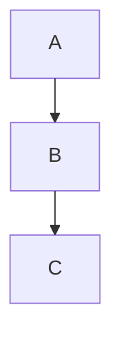

# Layout

The layout engine determines how Mermaid positions nodes and routes edges - it's a separate concern from the visual theme. Consult this reference when a diagram's default node placement/edge routing isn't what's wanted and a user asks about switching layout algorithms.

## Key concepts

Mermaid's documented layout page lists four supported layout algorithms:

- **`dagre`** - layered/hierarchical layout for layered graphs. This is Mermaid's long-standing default engine for graph-like diagrams.
- **`elk`** - the Eclipse Layout Kernel, a more sophisticated/configurable layout engine.
- **`tidy-tree`** - a tidy-tree layout aimed at hierarchical diagrams.
- **`cose-bilkent`** - a force-directed layout.

The layout is chosen via the `layout` config key, set the same way as any other config value: through frontmatter (`config: { layout: elk }`) or through `mermaid.initialize()`.

The page itself is intentionally thin - it states which four algorithms exist and that `layout` is set via YAML config/init options, but does not go into per-diagram-type applicability, defaults beyond naming dagre as the classic option, or setup/registration mechanics on this specific page.

**Not confirmed by this page (flagged, not asserted as fact):** general Mermaid ecosystem knowledge holds that the `elk` layout ships as a separate package (`@mermaid-js/layout-elk`) that must be registered at runtime (e.g. via `mermaid.registerLayoutLoaders(...)`) before `layout: elk` takes effect, and that not every diagram type honors every layout choice (dagre-oriented diagrams like flowcharts support elk; many non-graph diagram types like pie or Gantt have no alternate layout engine to select). Treat these two points as inferred, not sourced from `config/layouts.html` itself - verify against the installed Mermaid version's own docs/release notes before relying on them.

## Example

Selecting `elk` as the layout for this flowchart via frontmatter config, instead of the default `dagre`.

## Gotchas

- `layout` is a config key like any other - it can be set via frontmatter, `initialize()`, or (legacy) an init directive; there's nothing special about how it's applied.
- This page does not document elk's separate-package/registration requirement or which diagram types actually respect a non-default layout - don't assume `layout: elk` silently works for every diagram type without checking further if it appears to have no effect.

## Further reading
- https://mermaid.js.org/config/layouts.html
