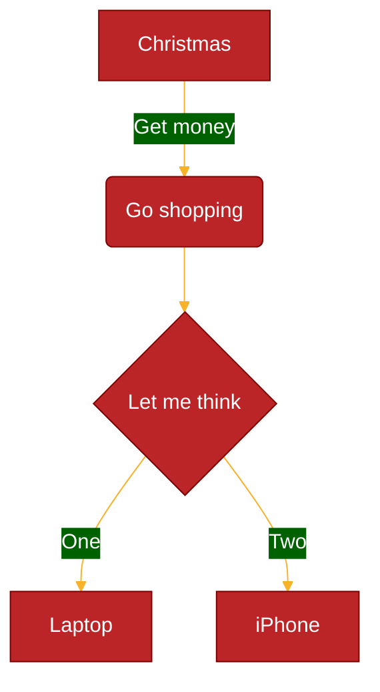

# Theming

Theming controls the color/font palette a diagram renders with. Reach for this reference when a user wants to change diagram colors beyond just picking a built-in theme name - i.e. when they want a genuinely custom palette rather than one of the stock looks.

## Key concepts

Mermaid ships five named themes: **default**, **neutral** (good for print/black-and-white docs), **dark** (pairs with dark-mode backgrounds - combine with `darkMode: true` in config to also adjust derived colors), **forest** (green-toned), and **base**. Of these, **only `base` is customizable** - it exists specifically as a starting point for building a custom palette; the other four are fixed.

Theme selection happens the same way as any other config: site-wide via `mermaid.initialize({ theme: 'base' })`, or per-diagram via frontmatter (`config: { theme: ... }`), or legacy per-diagram via an init directive.

Customization itself works through `themeVariables`, an object of named color/font tokens set alongside `theme: base`. Mermaid derives many colors from a small set of primary variables so a custom theme stays internally consistent without having to specify every token by hand - e.g. `primaryBorderColor` is automatically derived from `primaryColor` (via hue/lightness adjustments), and per-diagram-type variables (flowchart, sequence, pie, state, class, user-journey, etc.) in turn derive from the shared base variables (`primaryColor`, `secondaryColor`, `tertiaryColor`, `lineColor`, `textColor`, `mainBkg`, ...) unless explicitly overridden. The theming engine only understands hex colors (`#ff0000`), not CSS color names (`red`).

Confirmed default values of the core shared variables: `darkMode: false`, `background: #f4f4f4`, `fontFamily: trebuchet ms, verdana, arial`, `fontSize: 16px`, `primaryColor: #fff4dd`, `noteBkgColor: #fff5ad`, `noteTextColor: #333`; most others (`primaryTextColor`, `secondaryColor`, `tertiaryColor`, `lineColor`, `textColor`, `mainBkg`, etc.) are calculated from these rather than having an independent literal default.

## Example

Setting six variables on top of `theme: base` restyles the whole diagram; every derived color (borders, secondary/tertiary fills, cluster backgrounds, etc.) updates to stay consistent with these.

## Gotchas

- Setting `themeVariables` without also setting `theme: base` has no effect - only the base theme reads them.
- Named CSS colors (`red`, `teal`) are not recognized by the theming engine - use hex values.
- Per-diagram-type variable tables (flowchart, sequence, pie, state, class, user-journey, ...) exist beyond the shared core list - if a specific element's color looks unaffected by a core variable, check whether that diagram type has its own more specific variable overriding it.
- `dark` (the theme) and dark *mode* (`darkMode: true`) are related but distinct settings - the theme changes the diagram's own palette, `darkMode` affects how derived colors are calculated (intended for pairing with a dark page background).

## Further reading
- https://mermaid.js.org/config/theming.html
